# Relio 관리자 가이드

- **대상**: 시스템 관리자, 인프라·보안 엔지니어, DBA — 화면을 띄워 놓고 지키는 사람
- **기준 버전**: v1.11.19 (릴리즈 자산 `relio-v1.11.19.tar.gz`, 이미지 `relio:v1.11.19`)
- **함께 볼 문서**: 화면 사용법은 [사용자 가이드](USER_GUIDE.md), 보안 모델의 근거는 [Security Model](security.md), 구조는 [Architecture](architecture.md), REST·MCP 명세는 [REST API and MCP](api-mcp.md)

이 문서의 화면은 v1.11.19 소스로 띄운 실제 Relio 관리자 콘솔을 가짜 데이터로 찍은 것입니다. 명령의 비밀값은 모두 예시입니다.

---

## 1. 구성 요소

Relio 는 컨테이너 하나와 PostgreSQL 하나로 동작합니다. Redis, 메시지 큐, 별도 런타임, 외부 네트워크가 필요 없습니다.

| 구성 요소 | 무엇 | 주고받는 것 |
|---|---|---|
| `relio` 컨테이너 | Go 단일 바이너리. React 화면, REST API(`/api/v1`), MCP 서버(`/mcp`), OpenAPI 문서(`/api/openapi.json`), DB 마이그레이션, 백그라운드 작업(일별 Forecast Snapshot, 위험 분석, 회전 키 만료)을 모두 포함 | 브라우저·API 클라이언트·AI Agent 로부터 HTTP `8080` 수신. PostgreSQL 로 TCP 연결 |
| PostgreSQL | 모든 업무 데이터, 설정, 감사 로그, 세션. 개발용 compose 는 `postgres:17-bookworm` | `POSTGRES_DSN` 으로 지정 |
| `/var/lib/relio` 볼륨 | `secrets/master.key`(암호화 키 — `ENCRYPTION_KEY` 를 주지 않았을 때만 의미 있음), `uploads/`, `exports/` | 컨테이너 재생성 후에도 유지되어야 함 |
| Keycloak (선택) | 사내 SSO. OIDC Issuer 로 연결 | Discovery·JWKS 조회, `/api/v1/auth/oidc/callback` 로 콜백 |

컨테이너 안에서 바이너리는 UID/GID `10001` 로 실행되고, 이미지의 `HEALTHCHECK` 는 20초마다 `relio healthcheck` 를 호출합니다.

---

## 2. 설치

릴리즈 자산은 Docker 이미지 `tar.gz` 하나뿐입니다. 인터넷이 없는 서버에서도 아래 순서 그대로 됩니다.

### 2.1 필요한 것

| 항목 | 값 |
|---|---|
| 포트 | `8080/tcp` (컨테이너). 호스트 포트는 자유 |
| 볼륨 | `/var/lib/relio` — 이름 있는 볼륨 또는 호스트 경로. UID 10001 이 쓸 수 있어야 함 |
| 데이터베이스 | PostgreSQL (개발·검증 구성은 17). DB·사용자를 미리 만들어 둠. 스키마는 Relio 가 기동 시 직접 만듭니다 |
| 아키텍처 | `linux/amd64` |
| 자원 | 별도 최소 사양은 정해져 있지 않습니다. 비밀번호 검증(argon2id, 64 MiB)이 동시 로그인 요청 수만큼 메모리를 쓰므로 그만큼 여유를 둡니다 |

### 2.2 이미지 적재

```bash
# 릴리즈 페이지에서 받은 자산을 서버로 옮긴 뒤
gunzip -c relio-v1.11.19.tar.gz | docker load
docker image inspect relio:v1.11.19 --format '{{.Id}}'
```

### 2.3 PostgreSQL 준비

이미 운영 중인 PostgreSQL 이 있으면 DB 와 사용자만 만듭니다.

```sql
CREATE USER relio WITH PASSWORD '<db-password>';
CREATE DATABASE relio OWNER relio;
```

없으면 컨테이너로 띄웁니다.

```bash
docker network create relio-net
docker volume create relio-postgres-data
docker run -d --name relio-postgres --network relio-net \
  -e POSTGRES_DB=relio -e POSTGRES_USER=relio \
  -e POSTGRES_PASSWORD='<db-password>' \
  -v relio-postgres-data:/var/lib/postgresql/data \
  postgres:17-bookworm
```

### 2.4 Relio 기동

```bash
# 최초 1회만 생성하고 비밀번호 관리 도구에 보관합니다. 잃어버리면 SSO Client Secret 과
# 개인 연동 키를 다시 발급해야 합니다.
ENCRYPTION_KEY="$(openssl rand -hex 32)"

docker run -d --name relio --network relio-net \
  -p 8080:8080 \
  -e POSTGRES_DSN="postgres://relio:<db-password>@relio-postgres:5432/relio?sslmode=disable" \
  -e BOOTSTRAP_ADMIN="admin" \
  -e BOOTSTRAP_ADMIN_PASSWORD="<initial-admin-password, 12자 이상>" \
  -e ENCRYPTION_KEY="$ENCRYPTION_KEY" \
  -v relio-data:/var/lib/relio \
  --restart unless-stopped \
  relio:v1.11.19
```

기동 로그에서 마이그레이션과 키 검증이 끝나고 `Relio started` 가 찍히면 됩니다.

```bash
docker logs -f relio
curl -fsS http://127.0.0.1:8080/health/ready
# {"postgres":"ok","schema":{"schemaVersion":"012_personal_key_access_version.sql",...},"status":"ready"}
```

### 2.5 최초 관리자 로그인

1. 브라우저에서 `http://<서버>:8080` 을 엽니다.
2. `BOOTSTRAP_ADMIN` / `BOOTSTRAP_ADMIN_PASSWORD` 로 로그인합니다. **즉시 비밀번호 변경 화면으로 이동**하며, 바꾸기 전에는 다른 화면을 열 수 없습니다.
3. 오른쪽 위 프로필 메뉴 → **Admin Console** 로 들어가 **운영 현황판** 을 확인합니다.

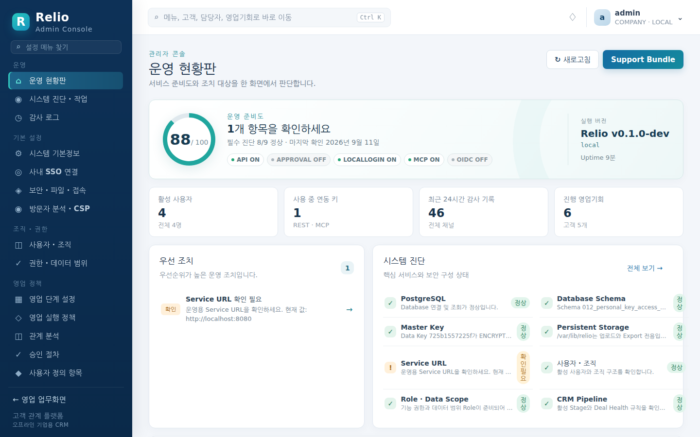

방금 설치한 상태에서는 우선 조치에 **Service URL 확인 필요** 가 뜹니다. **시스템 기본정보** 에서 사용자가 실제로 접속하는 주소로 바꿉니다 — SSO 콜백 주소와 MCP 가 허용하는 브라우저 Origin 이 이 값으로 만들어집니다.

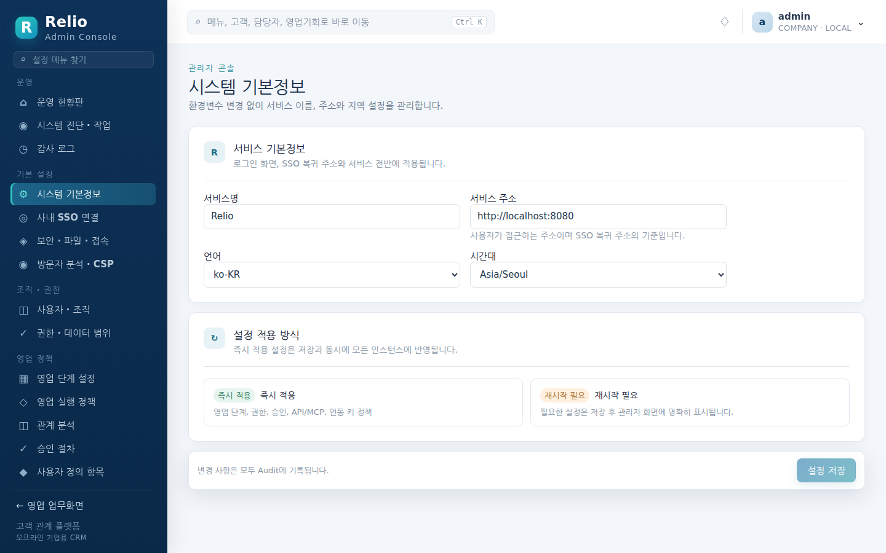

Bootstrap 관리자는 **삭제되지 않는 비상 계정(Break Glass)** 입니다. 최초 생성 뒤에는 환경 변수를 바꿔도 계정과 비밀번호를 덮어쓰지 않으며, 로컬 로그인을 꺼도 이 계정은 계속 로그인할 수 있습니다.

### 2.6 개발·검증용 compose

저장소를 받을 수 있는 환경이라면 `docker compose up --build` 로 PostgreSQL 과 Relio 가 함께 뜹니다(`compose.yaml`). 초기 비밀번호와 `ENCRYPTION_KEY` 가 파일에 적혀 있으므로 **운영에 그대로 쓰면 안 됩니다.**

---

## 3. 설정

### 3.1 환경 변수 (전수)

애플리케이션이 읽는 환경 변수는 아래 네 개가 전부입니다(`internal/config/config.go`, CI 의 `check-env-contract.sh` 가 이 계약을 검사합니다). 그 밖의 모든 설정은 PostgreSQL 에 저장되고 관리자 콘솔에서 바꿉니다.

| 이름 | 기본값 | 필수 | 설명 |
|---|---|---|---|
| `POSTGRES_DSN` | 없음 | 예 | PostgreSQL 접속 문자열. 예: `postgres://relio:<db-password>@db:5432/relio?sslmode=disable` |
| `BOOTSTRAP_ADMIN` | 없음 | 예 | 최초 기동 시 만들어지는 비상 관리자 아이디. DB 에 계정이 이미 있으면 무시됩니다 |
| `BOOTSTRAP_ADMIN_PASSWORD` | 없음 | 예 | 비상 관리자의 초기 비밀번호. **12자 미만이면 기동을 거부**합니다. 첫 로그인에서 반드시 변경됩니다 |
| `ENCRYPTION_KEY` | 없음 | 아니오 (강력 권장) | 개인 연동 키와 SSO Client Secret 을 감싸는 Instance Data Key 의 래핑 키. hex 64자(`openssl rand -hex 32`) 권장. 지정하면 볼륨을 새로 만들거나 서버를 옮겨도 자격증명이 유지됩니다. 지정하지 않으면 `/var/lib/relio/secrets/master.key` 에만 존재하므로 볼륨을 잃으면 복구할 수 없습니다 |

값을 잘못 주면 컨테이너가 바로 종료되며 로그에 `invalid startup configuration` 과 함께 이유(`POSTGRES_DSN, BOOTSTRAP_ADMIN and BOOTSTRAP_ADMIN_PASSWORD are required`, `BOOTSTRAP_ADMIN_PASSWORD must contain at least 12 characters`)가 찍힙니다.

리슨 주소 `:8080` 과 데이터 디렉터리 `/var/lib/relio` 는 고정이며 환경 변수로 바꿀 수 없습니다.

### 3.2 관리자 콘솔의 설정 (DB 저장)

관리자 콘솔 **기본 설정** 그룹의 화면이 아래 설정을 다룹니다. 재시작 없이 즉시 적용되고 변경은 감사 로그에 남습니다. REST 로는 `GET /api/v1/admin/settings?namespace=<이름>`, `PUT /api/v1/admin/settings/{namespace}/{key}` 로 같은 값을 다룹니다.

| 화면 | 네임스페이스 · 키 | 기본값 | 뜻 |
|---|---|---|---|
| 시스템 기본정보 | `system.service_name` | `Relio` | 화면·알림에 표시되는 서비스 이름 |
| | `system.service_url` | `http://localhost:8080` | 사용자가 접속하는 주소. SSO 콜백 URL 과 MCP Origin 허용의 기준 |
| | `system.locale` | `ko-KR` | 표시 로케일 |
| | `system.timezone` | `Asia/Seoul` | 계약·견적 번호의 날짜, 오늘 할 일의 기한 판정, 만료 D-day 를 세는 달력 |
| 보안 · 파일 · 접속 | `auth.local_login_enabled` | `true` | 끄면 SSO 로만 로그인. Bootstrap 관리자는 예외 |
| | `security.session_minutes` | `480` | 접속 유지 시간(분) |
| | `security.allowed_origins` | `[]` | 화면에 있으나 v1.11.19 서버 코드는 이 값을 읽지 않습니다. 교차 출처 정책은 `mcp.allowed_origins` 만 적용됩니다 |
| | `security.export_enabled` | `true` | CSV/Excel 내보내기 버튼 노출 |
| | `files.max_upload_mb` | `20` | 최대 파일 크기 |
| | `api.rate_limit_per_minute` | `120` | 신원(세션·키)당 분당 API 요청 한도. `0` 은 무제한 |
| 연동 키 · API · MCP | `api.enabled` / `keys.api_enabled` | `true` | 개인 연동 키의 REST 채널 |
| | `mcp.enabled` / `keys.mcp_enabled` | `true` | MCP 채널 |
| | `mcp.rate_limit_per_minute` | `60` | MCP 요청 한도 |
| | `mcp.allowed_origins` | `[]` | MCP 요청을 허용할 Origin |
| | `mcp.tool_allowlist` | `[]` | 비어 있으면 모든 도구, 채우면 그 도구만 노출 |
| | `keys.max_per_user` | `10` | 사용자당 키 개수 |
| | `keys.default_lifetime_days` / `keys.max_lifetime_days` | `365` / `730` | 키 기본·최대 수명 |
| | `keys.rotation_grace_hours` | `24` | 회전 후 옛 Secret 이 함께 유효한 시간 |
| 영업 실행 정책 | `sales_intelligence.risk_threshold` | `40` | 이 건강도 이하를 위험 딜로 봄 |
| | `sales_intelligence.inspection_days` | `7` | Deal Inspection 창 |
| | `sales_intelligence.snapshot_enabled` | `true` | 일별 Forecast Snapshot |
| | `sales_finance.base_currency` | `KRW` | 기준 통화 |
| | `sales_finance.renewal_radar_days` | `90` | 갱신 레이더가 보는 기간 |
| 관계 분석 | `relationship_intelligence.graph_max_nodes` | `100` | 관계도 최대 노드 |
| | `relationship_intelligence.default_plan_year` | `0` (=올해) | 전략 고객 계획 기본 연도 |
| | `relationship_intelligence.allowed_opportunity_roles` | `PRESALES, CONSULTANT, MANAGER, EXECUTIVE_SPONSOR, LEGAL, DELIVERY, OTHER` | 영업기회 협업팀 역할 |

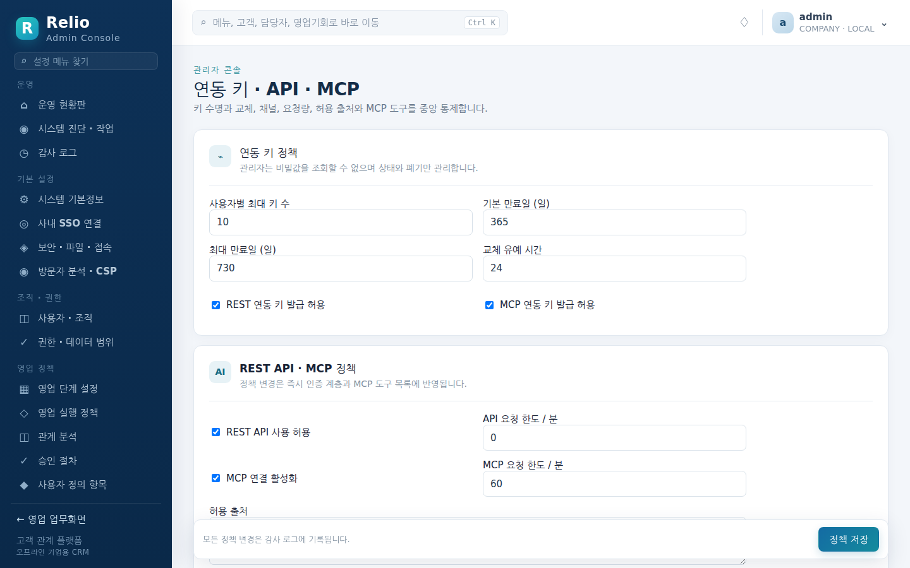

### 3.3 사내 SSO 연결 (Keycloak OIDC)

**사내 SSO 연결** 화면에 Issuer URL(예: `https://sso.company.internal/realms/enterprise`), Client ID, Client Secret 을 저장합니다. Client Secret 은 Instance Data Key 로 암호화되어 저장됩니다. **연결 테스트** 는 Discovery, TLS, JWKS, Callback 을 확인합니다(`POST /api/v1/admin/oidc/test`).

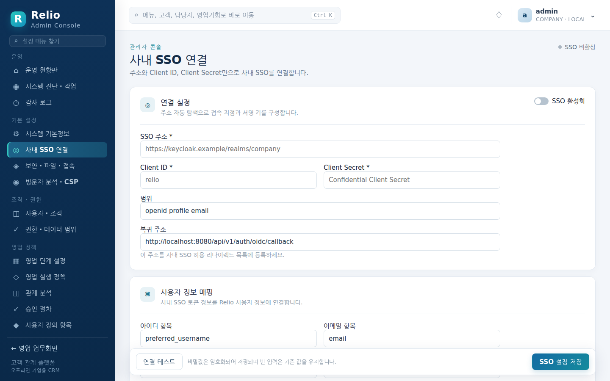

- Keycloak 클라이언트의 Redirect URI 는 `<system.service_url>/api/v1/auth/oidc/callback` 입니다.
- SSO 로 처음 로그인한 사용자는 **권한 · 데이터 범위** 에서 기본으로 지정한 Role(`영업 담당자`)을 자동으로 받습니다. 클레임 → Role/조직 매핑은 `GET/PUT /api/v1/admin/oidc/mappings` 로 다룹니다.

#### 자동 로그인 (silent SSO, `auto_login`)

Keycloak 에 이미 로그인한 사람이 Relio 를 열면 로그인 화면 없이 바로 본 화면으로 들어가게 하는 설정입니다. 같은 화면의 **자동 로그인** 체크박스로 켜고, REST 로는 `PUT /api/v1/admin/oidc` 의 `autoLogin` 입니다. **기본값은 꺼짐**이며 SSO 자체가 비활성이면 켜 두어도 동작하지 않습니다. 켜고 끈 이력은 감사 로그 `OIDC_CONFIG_UPDATE` 에 남습니다.

동작은 다음과 같습니다.

1. 세션이 없는 브라우저가 앱 경로(`/app/…`, `/admin/…`, `/me/…`)를 열면, 로그인 화면을 그리기 전에 `GET /api/v1/auth/oidc/start?prompt=none&return_to=<원래 경로>` 로 **최상위 이동**합니다. 숨은 iframe 을 쓰지 않으므로 서드파티 쿠키가 막힌 브라우저에서도 동작하고 Keycloak 의 프레임 정책과 무관합니다.
2. Keycloak 은 `prompt=none` 요청에 화면을 절대 그리지 않습니다. 세션이 있으면 인가 코드가 바로 돌아와 평소 SSO 로그인과 같은 절차로 세션이 만들어지고, 브라우저는 `return_to` 자리로 돌아갑니다(깊은 링크 유지). 세션이 없으면 `error=login_required` 로 돌아오는데 이것은 실패가 아니라 "세션 없음" 이라는 평범한 대답이므로 콜백은 오류 없이 `/login?sso=none` 으로 보냅니다.
3. 같은 시도를 반복하면 브라우저가 Keycloak 과 Relio 사이를 끝없이 오가므로 세 겹으로 막습니다. (1) 탭 세션마다 한 번만 시도하고 그 표시를 `sessionStorage` 에 남깁니다 — 새 탭은 다시 시도하고, 거절 뒤 새로고침은 시도하지 않습니다. (2) 사용자가 스스로 로그아웃하면 다음 로그인까지 시도하지 않습니다. (3) 콜백이 거절을 받으면 주소에 `?sso=none` 을 남겨 저장소가 지워졌더라도 다시 시도하지 않습니다. 브라우저 저장소를 읽을 수 없는 사생활 보호 모드에서는 "이미 시도했다" 로 간주해 시도하지 않습니다.
4. 서버는 이 설정이 꺼져 있으면 `?prompt=none` 이 붙어 와도 조용히 평범한 로그인으로 바꿉니다. 주소를 손봐서 흐름을 바꿀 수는 없습니다. `return_to` 는 `/` 로 시작하고 `//` 로 시작하지 않는 같은 출처의 앱 경로만 받으며, API·MCP·로그인 경로나 그 밖의 값은 `/app` 으로 대체됩니다.

자동 로그인이 거절되어 `/login?sso=none` 에 도착한 사용자에게는 로그인 화면이 "조직 계정 세션이 없어 자동으로 로그인하지 않았습니다" 라고 알려 줍니다. SSO 가 켜져 있으면 로그인 화면의 주 동작은 **조직 계정으로 SSO 로그인** 이고, Bootstrap·로컬 관리자 입력란은 **관리자 계정으로 로그인** 을 펼쳐야 나타나는 복구용 경로입니다.

로그인·콜백 경로와 API·MCP·헬스 경로에서는 시도하지 않습니다. 켜기 전에 **연결 테스트** 가 통과하고 수동 **조직 계정으로 SSO 로그인** 이 되는지 먼저 확인하세요 — 조용한 시도는 화면을 보여 주지 않으므로 설정 오류가 사용자에게는 "그냥 로그인 화면이 떴다" 로만 보이고, 원인은 서버 로그 `silent SSO attempt failed` 에 남습니다.

### 3.4 영업 정책

**영업 단계 설정**(단계·성공확률·전망 분류), **영업 실행 정책**(단계별 Playbook 과 전환 조건 `OFF`/`WARNING`/`BLOCK`, Deal Health 규칙과 배점), **승인 절차**, **사용자 정의 항목**, **상품 카탈로그**, **고객 요청 유형 · SLA** 가 여기 있습니다. 모두 코드 변경 없이 화면에서 바꾸고 즉시 반영됩니다.

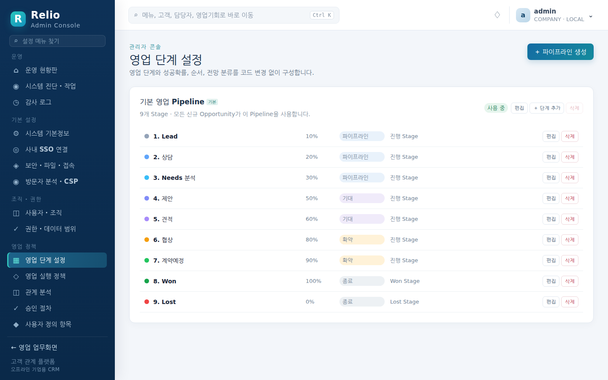

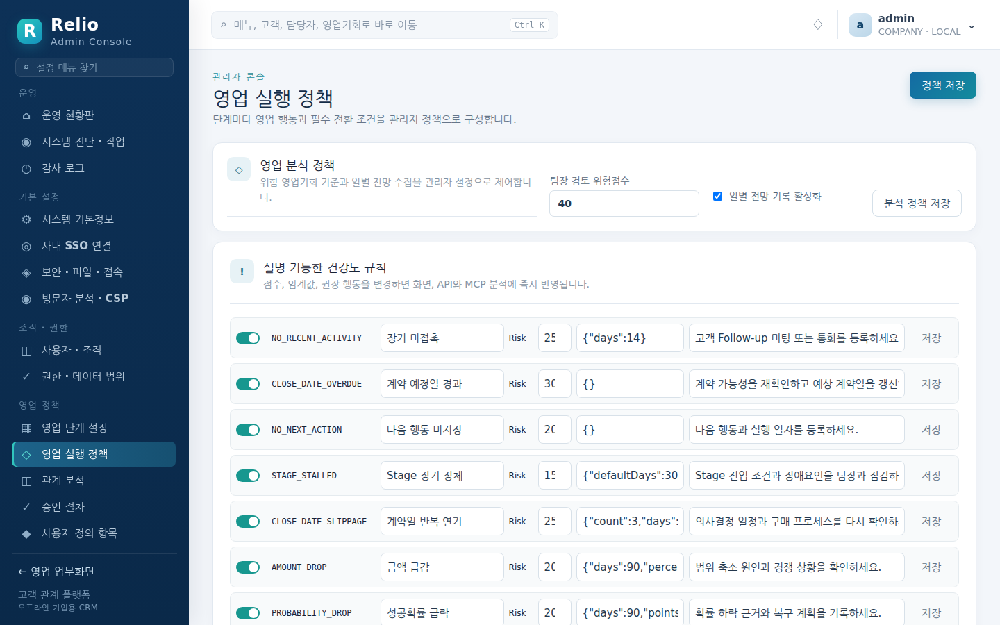

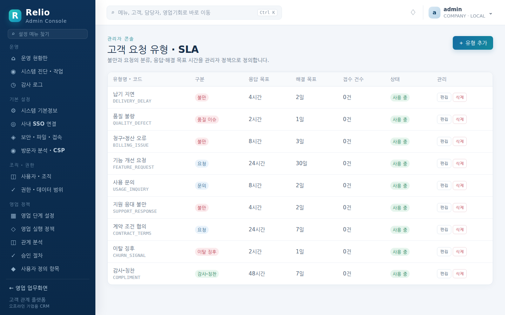

승인 절차는 **정책이 하나도 없으면 검토·승인 메뉴와 버튼이 서비스 전체에서 사라집니다.** 사용자가 "승인 메뉴가 없다"고 하면 정상입니다.

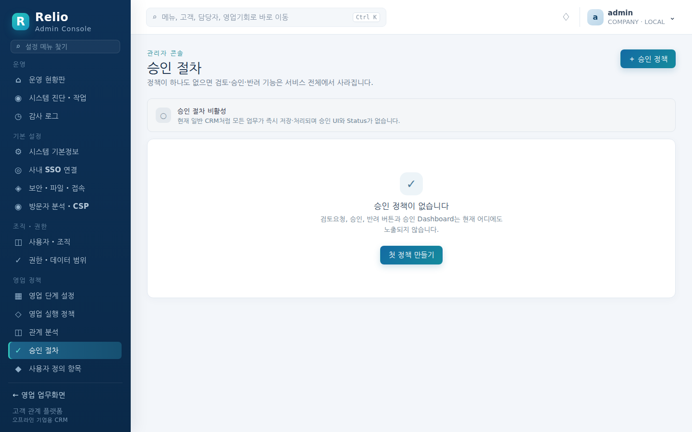

### 3.5 방문자 분석 · CSP (추적 스크립트)

**기본 설정 → 방문자 분석 · CSP** 에서 방문 추적 도구를 붙입니다. **기본값은 꺼짐**입니다 — 공급자를 하나도 등록하지 않은 설치는 런타임에 어떤 외부 요청도 하지 않고, 아래 설명은 아무것도 바꾸지 않습니다. 변경에는 `analytics:manage` 권한(기본 Role 중 시스템 관리자)이 필요하고 모든 변경은 감사 로그 `ANALYTICS_PROVIDER_CREATE/UPDATE/DELETE` 에 남습니다. REST 로는 `GET/POST /api/v1/admin/analytics`, `PUT/DELETE /api/v1/admin/analytics/{id}` 입니다.

#### 왜 그냥 `<script>` 를 붙여 넣지 않는가 — CSP

Relio 의 모든 응답에는 `script-src 'self'` 로 잠긴 Content Security Policy 가 붙습니다. 이 상태에서 추적 스니펫을 화면에 붙여 넣으면 브라우저가 **조용히 차단**하고, 관리자는 수집이 비어 있는 이유를 각 사용자의 개발자 콘솔을 열어 보기 전에는 알 수 없습니다. `'unsafe-inline'` 으로 정책을 푸는 방법은 쓰지 않습니다 — 한 번 풀면 그 앱의 모든 인라인 스크립트가 함께 허용되고, 추적을 끈 뒤에도 정책은 느슨한 채 남기 때문입니다.

대신 Relio 는 두 가지를 동시에 합니다.

1. **스니펫을 서버가 생성해 자기 출처에서 제공**합니다(`/analytics.js`). 관리자가 입력한 값(사이트 ID, 수집기 주소)으로 로더를 만들고, 붙여 넣은 JavaScript 는 받지 않습니다. 로더는 `'self'` 에 이미 포함되므로 nonce 도 `'unsafe-inline'` 도 필요 없고, 관리자 권한이 곧 전체 사용자 세션에 대한 스크립트 실행 권한이 되지 않습니다.
2. **정책은 같은 설정에서 계산**합니다. 공급자를 켜면 그 공급자가 필요로 하는 출처만 `script-src`·`connect-src`·`img-src` 에 더해지고, 끄면 즉시 원래대로 좁아집니다. 헤더를 손으로 고칠 일이 없습니다.

#### 공급자

| 공급자 | 필요한 값 | 정책에 더해지는 출처 |
|---|---|---|
| **Momento (사내 수집기)** — 목록의 첫 자리 | 사이트 ID, 수집기 주소(예: `https://momento.company.internal`) | **같은 오리진 프록시**가 켜져 있으면 없음(기본·권장). 끄면 수집기 주소 |
| Google Analytics 4 | 측정 ID | googletagmanager.com, google-analytics.com |
| Matomo / Plausible / Umami | 사이트 ID, 스크립트 출처 | 스크립트 출처 |
| 직접 지정 스크립트 | 스크립트 출처·경로 | 스크립트 출처 |

Momento 는 사내 자체 호스팅 수집기라 데이터가 밖으로 나가지 않는 유일한 선택지이며, 그래서 첫 자리에 있습니다. 생성되는 태그는 다음과 같습니다.

```html
<script async src="<수집기 주소>/tracker.js"
        data-site-id="<사이트 ID>" data-environment="prd" data-contract-version="1"></script>
```

`data-environment` 는 **스크립트 속성**에 `data-environment=stg` 처럼 적어 바꿀 수 있습니다. `data-site-id` 는 항상 검증된 사이트 ID 로 채워지며 속성으로 덮어쓸 수 없습니다.

#### 같은 오리진 프록시 (`/momento`)

Momento 를 추가할 때 **같은 오리진 프록시 사용** 이 기본으로 켜져 있습니다. 켜져 있으면:

- 추적기는 `/momento/tracker.js` 에서 로드되고 `data-endpoint="/momento"` 를 받아 이벤트도 `/momento/…` 로 보냅니다.
- Relio 가 `/momento/*` 를 수집기 주소로 넘깁니다. 브라우저 입장에서 모든 요청이 같은 출처이므로 **정책에 외부 출처가 아예 등장하지 않고** `script-src 'self'` 가 출하 상태 그대로입니다. 정책을 넓힐 수 없는 설치에서도 추적이 됩니다.
- 넘길 때 `Cookie`·`Authorization`·`X-CSRF-Token` 을 떼어 **사용자의 Relio 세션이 수집기로 가지 않게** 하고, 수집기의 `Set-Cookie` 와 정책 헤더는 브라우저에 전달하지 않습니다. 방문자 주소는 `X-Forwarded-For` 로 넘겨 수집기가 방문을 구분할 수 있게 합니다.
- `GET`·`HEAD`·`POST`·`OPTIONS` 만 통과하고 본문은 256 KB 로 제한합니다. 수집기가 응답하지 않으면 10초 뒤 `502` 로 끊어 화면이 분석 때문에 기다리지 않습니다.
- 공급자를 끄거나 지우면 정책이 좁아지는 것과 같은 순간에 `/momento` 도 `404` 로 닫힙니다. 아무 공급자도 켜지 않은 설치에서 `/momento` 는 처음부터 `404` 입니다.

프록시를 끄면 추적기가 수집기 주소에서 직접 로드되고 그 주소가 `script-src` 와 `connect-src` 에 들어갑니다. 수집기가 Relio 와 다른 네트워크 경로에 있어 Relio 서버에서는 닿지 않고 브라우저에서는 닿는 경우에만 끕니다.

#### 차단된 요청 확인

공급자가 켜져 있는 동안 정책에 `report-uri /api/v1/csp-report` 가 붙어 브라우저가 거부한 요청을 Relio 로 신고합니다. 같은 화면 상단의 **차단된 요청** 에 **지시어와 출처** 가 모입니다(같은 출처는 횟수만 늘어나 쌓이지 않습니다). 추적기가 스크립트 출처와 다른 주소로 이벤트를 보내면 여기 `connect-src` 로 나타나므로, **이 출처 허용** 을 눌러 공급자의 추가 수집 출처에 넣으면 됩니다. 신고 경로는 브라우저가 자격 증명 없이 보내므로 인증이 없고, 본문은 크기 제한·재검증을 거쳐 출처 단위로만 저장됩니다.

#### 붙지 않는 곳

- `/api/*`·`/mcp`·`/health/*` 같은 비화면 응답에는 스크립트가 들어갈 자리가 없습니다.
- **로그인 후 화면만 추적** 을 켜면 세션 쿠키가 없는 로그인 화면에서는 추적기를 로드하지 않습니다. 기본은 꺼짐입니다. 추적기는 페이지 안에서 실행되는 스크립트이므로, 자격 증명을 다루는 화면까지 추적할지는 수집기를 신뢰하는 정도에 따라 정합니다 — 확신이 없으면 켭니다.
- **Do Not Track 요청 존중** 이 기본으로 켜져 있어 브라우저가 DNT 를 보내면 로드하지 않습니다.

---

## 4. 계정과 권한

권한은 세 겹의 교집합입니다: **기능 권한**(Role 의 `customer:read` 같은 항목) ∩ **데이터 범위**(Role 의 본인/팀/부서/본부/전사) ∩ **개인 연동 키 범위**(API·MCP 로 올 때). 화면, REST, MCP 어디서 오든 같은 규칙을 탑니다.

### 4.1 기본 제공 Role

| Role | 코드 | 데이터 범위 | 할 수 있는 일 |
|---|---|---|---|
| 시스템 관리자 | `SYSTEM_ADMIN` | 전사 | `admin:*` — 관리자 콘솔 전체. Bootstrap 관리자가 이 Role 을 가집니다 |
| 영업 팀장 | `SALES_MANAGER` | 팀 | 영업 담당자의 모든 권한 + `approval:approve`, `forecast:write`, `contract:write`, `sales:write`, `target:write`, `product:write` |
| 영업 담당자 | `SALES_USER` | 본인 | 고객·담당자·영업기회·활동·견적 읽기/쓰기, 계약·상품·전망 읽기, `approval:request`, `mcp:use`. **SSO 신규 사용자의 기본 Role** |

기능 권한 목록: `activity`, `contact`, `customer`, `lead`, `opportunity`, `quotation`, `notification` 의 `:read`/`:write`, `contract`·`product`·`sales`·`target`·`forecast`·`intelligence` 의 `:read`/`:write`, `report:read`, `approval:request`/`:approve`, `voice:read`/`:write`/`:manage`, `analytics:manage`, `mcp:use`, `customer:delete`, `admin:read`/`admin:write`.

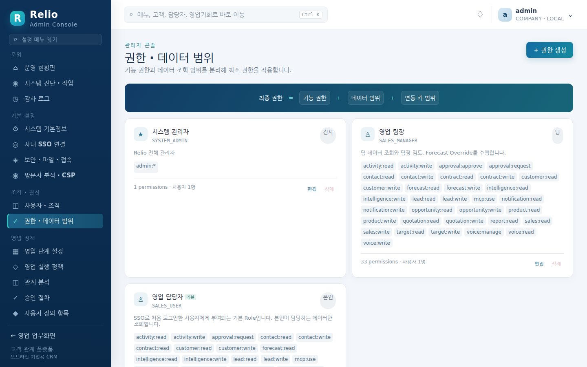

### 4.2 사용자 · 조직

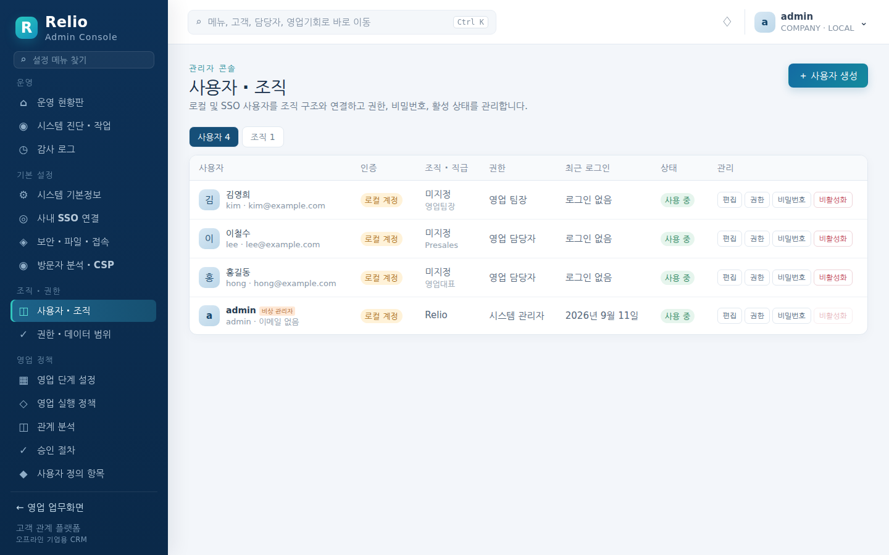

- **＋ 사용자 생성**: 로컬 계정을 만듭니다. 초기 비밀번호를 지정하면 첫 로그인에서 변경이 강제됩니다.
- **권한**: Role 을 부여합니다. Role 이 하나도 없는 사용자는 로그인은 되지만 "아직 사용 권한이 없습니다" 만 봅니다.
- **비밀번호**: 로컬 계정 재설정. SSO 계정에는 비밀번호가 없습니다.
- **비활성화**: 즉시 로그인이 막히고 세션이 끝납니다. Bootstrap 관리자는 비활성화·삭제할 수 없습니다.
- 조직 탭에서 조직 트리를 만들고 사용자를 배치합니다. 데이터 범위(팀/부서/본부)는 이 트리를 기준으로 계산됩니다.

### 4.3 개인 연동 키 관리

사용자는 자기 키를 발급·회전·폐기하고, 관리자는 **연동 키 · API · MCP** 에서 전체 키를 보고 `POST /api/v1/admin/users/{id}/keys/revoke-all` 로 한 사용자의 키를 모두 회수할 수 있습니다. 서버는 Secret 의 HMAC Digest 만 저장하므로 DB 가 유출되어도 키가 복원되지 않습니다.

### 4.4 조직 계정(OAuth)으로 MCP 연결

개인 키 대신 Keycloak 조직 계정으로 MCP 에 로그인하게 하는 설정입니다. MCP Authorization 명세에 따라 Relio 는 **OAuth Resource Server** 로 동작합니다. 로그인·동의·토큰 발급은 Keycloak 이 하고, Relio 는 Keycloak 이 Relio 를 대상으로 발급한 Access Token 만 받습니다. **기본값은 꺼짐**입니다 — 에이전트가 로그인한 사용자의 Role 권한 전체로 동작하기 때문입니다(개인 키처럼 Scope 로 좁힐 수 없습니다).

**연동 키 · API · MCP → 조직 계정(OAuth)으로 MCP 연결** 에서 켜고, 같은 곳의 준비 상태 목록(`GET /api/v1/admin/mcp/oauth`)으로 점검합니다.

| 설정 | 키 | 뜻 |
|---|---|---|
| OAuth 허용 | `mcp.oauth_enabled` | 켜면 `/.well-known/oauth-protected-resource/mcp` 를 공개하고 MCP 의 401 응답에 `resource_metadata` 를 넣습니다. 끄면 두 가지 모두 사라지고 MCP 는 Keycloak 토큰을 거부합니다(REST 의 기존 Bearer 동작은 영향 없음). |
| 필수 Scope | `mcp.oauth_required_scope` | 이 Scope 가 없는 토큰은 `403 insufficient_scope` 로 거부합니다. 비우면 Audience 만 확인합니다. |
| 에이전트용 Public Client ID | `mcp.oauth_client_id` | 사용자 **MCP 사용 안내** 에 표시됩니다. 비우면 동적 클라이언트 등록을 안내합니다. |

**Keycloak 설정 (권장 — 사전 등록 Public Client)**

1. Client Scope `relio-mcp` 를 만들고 **Audience** Mapper 를 추가합니다. Included Client Audience 는 Relio 의 SSO Client ID(예: `relio`), **Add to access token** 을 켭니다. 이 Mapper 가 없으면 토큰의 `aud` 에 Relio 가 없어 모든 요청이 `invalid_token` 으로 거부됩니다.
2. Public Client `relio-mcp-cli` 를 만듭니다. Client authentication 끔, Standard flow 켬, PKCE Method `S256`, Valid redirect URIs `http://127.0.0.1/*`, `http://localhost/*`. Keycloak 은 Loopback 주소의 임의 포트를 허용하므로 CLI 가 고르는 포트(OpenCode 19876, Qwen 7777 등)가 모두 맞습니다.
3. 이 Client 의 Client scopes 에 `relio-mcp` 를 **Optional** 로 붙입니다.
4. Relio 화면에 필수 Scope `relio-mcp`, Public Client ID `relio-mcp-cli` 를 저장합니다.

**동적 클라이언트 등록(DCR)을 쓰려면** Realm 의 Client registration → Anonymous access policies 에서 다음을 바꿉니다. 등록된 클라이언트에는 Keycloak 이 동의 화면을 요구합니다.

- **Allowed Client Scopes**: `relio-mcp` 추가. (Relio 는 `openid` 를 광고하지 않습니다 — 클라이언트가 등록 요청에 그대로 옮겨 적고, Keycloak 이 이 정책으로 거부하기 때문입니다.)
- **Trusted Hosts**: `127.0.0.1`, `localhost` 를 넣고 *Host sending registration request must match* 를 끕니다. OpenCode 는 등록 요청에 `client_uri: https://opencode.ai` 를 보내므로 `opencode.ai` 도 넣어야 합니다(문자열 비교이며 외부 통신은 없습니다).
- Qwen Code 는 Keycloak 처럼 Issuer 에 경로(`/realms/…`)가 있는 서버와 DCR 을 하지 못합니다(0.20.1 실측). Qwen 사용자에게는 Public Client ID 를 안내하세요.

**서비스 URL** — 리소스 식별자는 `system.service_url` + `/mcp` 입니다. 클라이언트는 자신이 접속한 주소와 이 값이 다르면 연결을 거부하므로, 서비스 URL 을 사용자가 실제로 쓰는 주소로 맞추세요. 준비 상태 목록이 `localhost` 로 남은 서비스 URL 을 경고합니다.

**감사와 추적** — OAuth 로 들어온 MCP 요청은 `mcp_request_logs` 에 `auth_method = OIDC_ACCESS_TOKEN` 과 Keycloak `azp`(`oauth_client`) 로 남아 개인 키 요청과 구분됩니다. 처음 MCP 로 접속한 SSO 사용자는 브라우저 첫 로그인과 같은 규칙(자동 생성 설정, 기본 Role)으로 만들어집니다.

---

## 5. 운영

### 5.1 상태 점검

| 방법 | 무엇을 알려 주나 |
|---|---|
| `GET /health/live` | 프로세스 생존 |
| `GET /health/ready` | PostgreSQL 연결과 스키마 버전. 로드밸런서·오케스트레이터의 readiness 로 씁니다 |
| `GET /health` | 위 둘의 요약 |
| `GET /api/v1/system/version` | 버전·커밋·빌드 시각·에디션 (인증 불필요) |
| 컨테이너 `HEALTHCHECK` | `relio healthcheck` — `docker ps` 의 `healthy` 표시 |
| 관리자 콘솔 **시스템 진단 · 작업** | PostgreSQL, Schema, Master Key, Storage, Service URL, 사용자·조직, Role, Pipeline, Background Job, Keycloak, REST API, MCP, 승인 Workflow 진단 (`GET /api/v1/admin/operations`) |

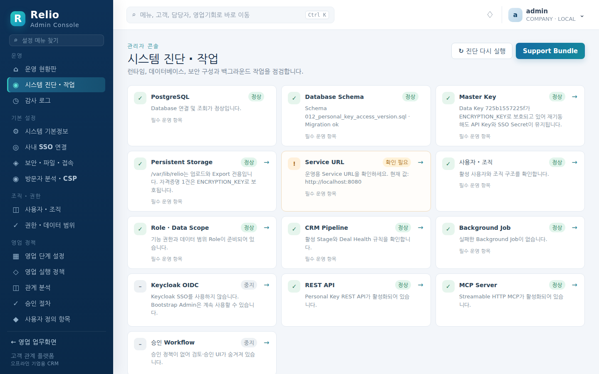

**Support Bundle**(`GET /api/v1/admin/operations/support-bundle`)은 진단 결과·버전·설정을 JSON 하나로 내려받습니다. 비밀번호, SSO Secret, 키 Digest 는 들어가지 않으며 다운로드 자체가 감사 로그에 `SUPPORT_BUNDLE_EXPORT` 로 남습니다. 문제를 보고할 때 이 파일을 첨부하세요.

### 5.2 로그

로그는 JSON 한 줄 형식으로 표준 출력에 나갑니다. 파일로 쓰지 않으므로 `docker logs` 나 컨테이너 런타임의 로그 드라이버로 수집합니다.

```bash
docker logs --since 1h relio | jq -r 'select(.level=="ERROR") | "\(.time) \(.msg) \(.error // "")"'
```

모든 API 응답 오류에는 `requestId` 가 있고, 같은 값이 서버 로그의 `requestId` 와 감사 로그에 찍힙니다. 사용자가 전달한 ID 로 세 곳을 이어 봅니다.

### 5.3 감사 로그

**감사 로그** 화면은 WEB·API·MCP·ADMIN·LOGIN·SSO 채널(개인 키 작업은 WEB 채널의 `KEY_*` 동작)의 작업을 검색하고 변경 전후를 비교합니다(`GET /api/v1/admin/audit?channel=&q=&limit=`). 목록의 시각은 초 단위까지 보여 같은 날의 로그인 여러 건도 순서를 가릴 수 있습니다. 감사 행은 PostgreSQL 에 남으므로 보관 기간은 DB 백업 정책을 따릅니다. 행을 열면 시각·User-Agent 와 변경 전후 외에 **부가 정보**(로컬 로그인의 Bootstrap 계정 여부, SSO 로그인의 자동 로그인 여부 등 동작에 딸린 값)가 있을 때만 그 아래에 함께 보입니다.

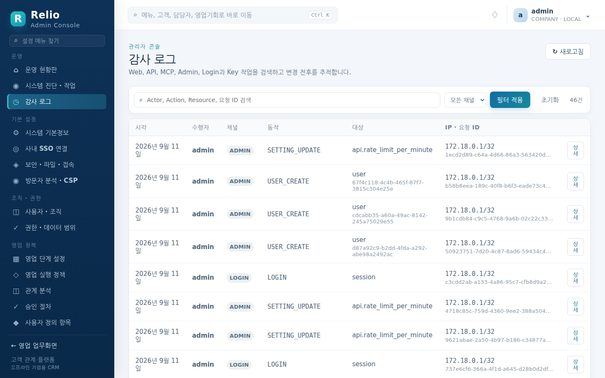

### 5.4 백업

백업할 것은 두 가지이고, **같은 시점**으로 맞춰야 합니다.

1. **PostgreSQL** — 모든 데이터.
2. **암호화 키** — `ENCRYPTION_KEY` 를 쓰고 있다면 그 값(비밀번호 관리 도구에 이미 있어야 합니다). 쓰지 않는다면 `/var/lib/relio/secrets/master.key`. 이 키 없이 DB 만 복원하면 개인 연동 키와 SSO Client Secret 을 열 수 없어 다시 발급해야 합니다.

```bash
# DB
docker exec relio-postgres pg_dump -U relio -d relio -F c > relio-$(date +%Y%m%d).dump
# 볼륨 (ENCRYPTION_KEY 를 쓰지 않을 때 필수, 쓸 때도 uploads/exports 를 위해 권장)
docker run --rm -v relio-data:/data -v "$PWD":/backup debian:bookworm-slim \
  tar czf /backup/relio-data-$(date +%Y%m%d).tar.gz -C /data .
```

### 5.5 복구

```bash
docker stop relio
docker exec -i relio-postgres psql -U relio -d postgres -c 'DROP DATABASE relio' -c 'CREATE DATABASE relio OWNER relio'
docker exec -i relio-postgres pg_restore -U relio -d relio < relio-20260911.dump
docker run --rm -v relio-data:/data -v "$PWD":/backup debian:bookworm-slim \
  tar xzf /backup/relio-data-20260911.tar.gz -C /data      # master.key 를 쓰는 경우
docker start relio
```

복구 후 기동 로그에 `instance encryption key verified` 가 찍혀야 합니다. `instance encryption key integrity check failed` 가 나오면 DB 와 키가 서로 다른 시점의 것입니다 — Relio 는 데이터 손상을 막기 위해 **새 키를 만들지 않고 기동을 멈춥니다.** 원래 `ENCRYPTION_KEY` 를 넣거나 같은 시점의 `master.key` 를 복원하세요.

### 5.6 업그레이드

마이그레이션은 새 버전이 기동하면서 자동으로 적용됩니다. 되돌릴 수 없으므로 **업그레이드 직전 백업(5.4)** 이 곧 롤백 수단입니다.

```bash
gunzip -c relio-v1.11.19.tar.gz | docker load
docker stop relio && docker rename relio relio-old
docker run -d --name relio --network relio-net -p 8080:8080 \
  -e POSTGRES_DSN="..." -e BOOTSTRAP_ADMIN="admin" -e BOOTSTRAP_ADMIN_PASSWORD="..." \
  -e ENCRYPTION_KEY="$ENCRYPTION_KEY" -v relio-data:/var/lib/relio \
  --restart unless-stopped relio:v1.11.19
docker logs -f relio            # "Relio started" 확인
curl -fsS http://127.0.0.1:8080/health/ready | jq .schema.schemaVersion
docker rm relio-old             # 확인 뒤
```

- 같은 볼륨·같은 `ENCRYPTION_KEY` 를 넘겨야 합니다. 이전 버전에서 `ENCRYPTION_KEY` 없이 운영하다가 이번에 처음 주면, 기동 시 `instance data key re-wrapped with the new wrapping key` 로그와 함께 기존 자격증명이 그대로 새 키로 감싸집니다.
- **롤백**: 새 컨테이너를 멈추고 → 업그레이드 직전 DB 덤프를 복원(5.5)하고 → 이전 이미지로 다시 기동합니다. 스키마가 올라간 DB 에 이전 이미지를 붙이지 마세요.
- 릴리즈 파이프라인은 직전 발행 릴리즈 이미지에서 새 이미지로 올리는 업그레이드 테스트(`scripts/run-upgrade-container-test.sh <old> <new>`)를 통과해야 발행되므로, 한 버전씩 순서대로 올리는 경로는 검증되어 있습니다.

### 5.7 데이터 품질과 설정 이관

**데이터 품질 · 설정 이관** 화면은 고객·담당자·영업기회의 완성도를 0~100 점수와 표본으로 진단하고(`GET /api/v1/admin/data-quality`), 영업 정책·Role·설정을 비밀값 없이 JSON 번들로 내보내(`GET /api/v1/admin/configuration/export`) 다른 환경에 적용합니다. 적용은 두 단계입니다: `POST /api/v1/admin/configuration/preview` 로 생성·갱신·변경 없음 Diff 를 보고, `POST /api/v1/admin/configuration/apply` 에 `{"confirmation":"APPLY","bundle":…}` 로 비파괴 Upsert 합니다. 업무 데이터는 번들에 포함되지 않습니다.

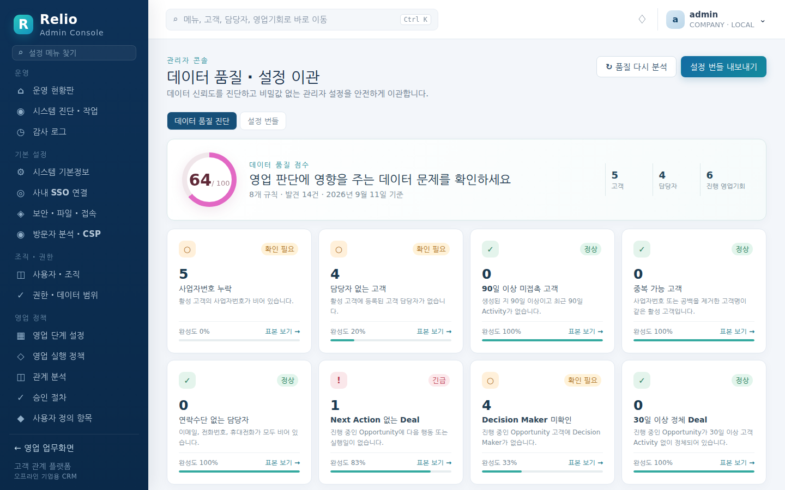

---

## 6. 장애 대응

| 증상 | 확인할 곳 | 조치 |
|---|---|---|
| 컨테이너가 바로 종료됨. 로그 `invalid startup configuration` | `docker logs relio` 첫 줄 | 메시지대로 환경 변수를 채웁니다. 비밀번호는 12자 이상 |
| 로그 `waiting for PostgreSQL` 반복 후 `PostgreSQL unavailable` | DSN 의 호스트·포트·네트워크, PostgreSQL 컨테이너 상태 | 같은 Docker 네트워크에 있는지, `sslmode` 가 서버 설정과 맞는지 확인 |
| 로그 `database migration failed` | 메시지에 실패한 마이그레이션 파일명 | DB 사용자에게 DDL 권한이 있는지, 디스크가 찼는지 확인. 반복되면 직전 백업으로 복구 후 Support Bundle 과 함께 보고 |
| 로그 `instance encryption key integrity check failed` | `ENCRYPTION_KEY` 값, 볼륨의 `secrets/master.key` | DB 와 키가 다른 시점. 5.5 참고. **새 키로 억지로 기동하지 않습니다** — 기동 자체가 거부되도록 설계되어 있습니다 |
| 로그 `credential protection depends on the /var/lib/relio volume` | — | 경고. `ENCRYPTION_KEY` 를 지정하라는 뜻입니다. 볼륨 백업을 빠뜨리지 않는 한 동작에는 문제 없음 |
| 로그 `bootstrap administrator initialization failed` | DB 권한, `BOOTSTRAP_ADMIN` 값 | 최초 기동에서만 나옵니다. DB 를 비우고 다시 시도 |
| `/health/ready` 가 실패 | 응답 본문의 `postgres`, `schema.status` | DB 연결 또는 마이그레이션 문제. 위 항목 참고 |
| 사용자가 `로그인 시도가 너무 많습니다` 를 봄 | 감사 로그 `LOGIN_FAILED` 의 IP | 같은 주소의 실패 반복. 공용 NAT 뒤라면 정상 사용자도 걸릴 수 있습니다. 잠시 기다리면 풀립니다 |
| 사용자가 `일반 로컬 로그인이 비활성화되어 있습니다` 를 봄 | 보안 · 파일 · 접속 → 일반 로컬 로그인 허용 | SSO 가 죽어 로컬로 들어와야 하면 Bootstrap 관리자로 로그인해 켭니다. Bootstrap 은 이 설정과 무관하게 항상 로그인됩니다 |
| SSO 로그인 후 "아직 사용 권한이 없습니다" | 권한 · 데이터 범위의 기본 Role 지정 | 기본 Role 이 비어 있으면 지정. 이미 들어온 사용자는 사용자 · 조직 → 권한에서 부여 |
| 자동 로그인을 켰는데 로그인 화면이 뜸 | 서버 로그 `silent SSO declined` / `silent SSO attempt failed`, 주소의 `?sso=none` | `?sso=none` 은 Keycloak 이 세션 없음(`login_required`)으로 답했다는 뜻이며 정상입니다. 로그아웃 직후에는 의도적으로 시도하지 않습니다. 세션이 있는데도 뜬다면 로그의 오류 코드를 봅니다 — `consent_required` 면 Keycloak 클라이언트의 Consent Required 를 끄고, `attempt failed` 로 남은 다른 코드는 클라이언트 설정 오류입니다 |
| SSO 콜백이 실패 | 사내 SSO 연결 → 연결 테스트 결과(Discovery/TLS/JWKS/Callback) | Keycloak 의 Redirect URI 가 `<service_url>/api/v1/auth/oidc/callback` 인지, `system.service_url` 이 실제 접속 주소인지, 사내 CA 인증서가 컨테이너에 있는지 확인 |
| API 클라이언트가 HTTP 429 | 보안 · 파일 · 접속 → API 요청 한도 / 분, 연동 키 · API · MCP → MCP 요청 한도 | 신원당 한도입니다. 정당한 배치 작업이면 한도를 올리거나 키를 나눕니다 |
| MCP 도구가 안 보임 | `mcp.tool_allowlist`, 키의 범위와 채널, `mcp.allowed_origins` | 허용 목록·범위·Origin 세 가지 교집합입니다 |
| 로그 `capture forecast snapshot` / `run intelligence analysis` / `expire rotated keys` 오류 | 시스템 진단 → Background Job 카드 | 다음 주기에 재시도됩니다. `snapshot ran without the lock`·`take maintenance lock` 은 DB 잠금 문제이므로 PostgreSQL 상태를 봅니다 |
| 사용자가 `서버 오류가 발생했습니다.` 와 요청 ID 를 전달 | `docker logs relio \| grep <requestId>` | `service error` 줄의 `error` 필드가 원인입니다 |
| 방문자 분석을 켰는데 수집기에 아무것도 안 들어옴 | 방문자 분석 · CSP → 차단된 요청, 브라우저 개발자 콘솔의 `Content Security Policy` 오류 | 차단된 출처가 보이면 **이 출처 허용**. Momento 는 **같은 오리진 프록시** 를 켜면 정책과 무관해집니다. 프록시를 켰는데 `/momento/tracker.js` 가 `502` 면 Relio 서버에서 수집기 주소로 닿지 않는 것이고(로그 `momento proxy upstream failed`), `404` 면 켜진 Momento 공급자가 없는 것입니다. DNT 를 켠 브라우저는 의도적으로 로드하지 않습니다 |

---

## 7. 보안

**설치 직후 바꿀 것**

- `BOOTSTRAP_ADMIN_PASSWORD` 는 첫 로그인에서 강제로 바뀌지만, 환경 변수에 남은 초기값도 예시가 아닌 강한 값으로 두고 배포 파일을 비밀로 관리합니다.
- `system.service_url` 을 실제 주소로. 기본값 `http://localhost:8080` 은 SSO 콜백을 깨뜨립니다.
- `ENCRYPTION_KEY` 를 지정하고 비밀번호 관리 도구에 보관합니다.
- 일상 관리자 계정을 따로 만들고 Bootstrap 계정은 비상용으로만 씁니다. Bootstrap 은 삭제·비활성화가 불가능하므로 비밀번호 보관을 특히 신경 씁니다.
- 사내 SSO 를 연결한 뒤에는 **일반 로컬 로그인 허용** 을 끄는 것을 검토합니다.

**외부에 열면 안 되는 것**

- PostgreSQL 포트. Relio 컨테이너만 접근해야 합니다.
- `/var/lib/relio` 볼륨. `secrets/master.key` 가 있습니다.
- `8080` 을 인터넷에 직접 노출하지 말고 TLS 를 종단하는 리버스 프록시 뒤에 둡니다. 단, Relio 는 `X-Forwarded-For` 를 읽지 않고 TCP 피어 주소만 기록하므로 프록시 뒤에서는 감사 로그의 IP 와 로그인 시도 제한이 프록시 주소 기준이 됩니다 — 로그인 경로(`POST /api/v1/auth/login`)의 요청 제한은 프록시에서도 걸어 두세요.

**기본 보호 장치** (보안 · 파일 · 접속 화면 하단에 요약되어 있습니다)

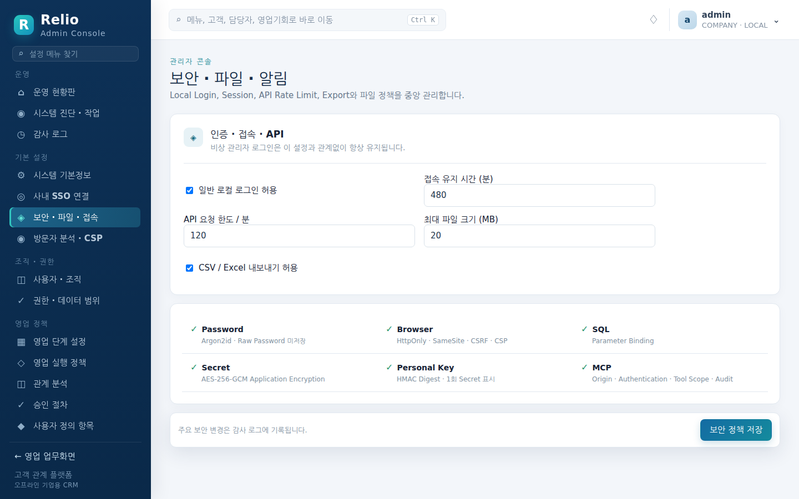

- 비밀번호는 argon2id 로 저장하며 원문을 보관하지 않습니다. 존재하지 않는 계정·비활성 계정도 같은 시간을 들여 거절해 아이디 열거를 막습니다.
- 세션 쿠키는 HttpOnly·SameSite, 상태 변경 요청은 CSRF 토큰, 응답에는 CSP 가 붙습니다. 기본 상태에서 외부 CDN·폰트·분석 스크립트가 없고, 방문자 분석은 **방문자 분석 · CSP** 에서 출처별로 명시적으로 허용한 것만 CSP 에 추가됩니다. `'unsafe-inline'` 스크립트는 어떤 설정으로도 허용되지 않으며, Momento 의 같은 오리진 프록시(`/momento`)는 세션 쿠키를 떼고 넘깁니다(3.5).
- SSO Client Secret 은 AES-256-GCM 으로, 개인 연동 키는 HMAC Digest 로만 저장됩니다.
- MCP 는 Origin 검사, 개인 연동 키 인증, 도구 허용 목록, 감사 로그를 거칩니다.
- 주요 보안 설정 변경은 모두 감사 로그에 남습니다.

자세한 위협 모델과 근거는 [Security Model](security.md) 을 보세요.

---

## 부록. 이 가이드의 화면 캡처 다시 찍기

캡처는 `scripts/guide/screenshots.mjs` 가 만듭니다. **버려도 되는 배포**에 가짜 데이터를 채우고 headless Chrome 으로 1440×900 화면을 `docs/assets/guide/` 에 저장합니다. 대상 주소·계정은 전용 환경 변수로만 받고, `RELIO_GUIDE_DISPOSABLE=1` 이 없으면 시작하지 않습니다. 실행 중 API 요청 한도를 잠시 올렸다가 끝나면 원래 값으로 되돌리며, 그 밖의 전역 설정은 건드리지 않습니다.

```bash
docker compose -p relio-guide up --build -d          # 개발 compose 로 임시 배포
cd scripts/guide && npm install --no-audit --no-fund
RELIO_GUIDE_URL=http://127.0.0.1:8080 RELIO_GUIDE_DISPOSABLE=1 \
RELIO_GUIDE_ADMIN=admin RELIO_GUIDE_PASSWORD='<compose 의 초기 비밀번호>' \
RELIO_GUIDE_NEW_PASSWORD='<첫 로그인에서 바꿀 비밀번호>' \
RELIO_GUIDE_SEED_PASSWORD='<데모 동료 계정 비밀번호>' \
node screenshots.mjs
docker compose -p relio-guide down -v                # 끝나면 폐기
```

PDF 는 저장소 밖의 공용 가이드 도구(`md2pdf.mjs`)로 굽습니다. 저장소 안에 별도 변환기를 두지 않습니다.
