# Relio 사용자 가이드

- **대상**: 영업대표, 영업팀장, Presales, 영업운영 담당자 — 화면을 쓰는 사람
- **기준 버전**: v1.11.19
- **함께 볼 문서**: 설치·설정·계정 관리는 [관리자 가이드](ADMIN_GUIDE.md), REST API·MCP 도구 목록은 [REST API and MCP](api-mcp.md)

이 문서의 화면은 모두 v1.11.19 소스로 띄운 실제 Relio 에 가짜 데이터(`데모전자(주)`, `hong@example.com` 등)를 채워 찍은 것입니다.

---

## 1. 이 제품이 하는 일

Relio 는 인터넷이 끊긴 사내망에서 돌아가는 B2B 영업관리(CRM)입니다. 고객·담당자·영업기회·영업활동·계약을 한곳에 기록하고, 그 기록에서 **오늘 무엇을 먼저 해야 하는지**를 대신 골라 줍니다 — 기한을 넘긴 고객 요청, 마감이 지난 다음 행동, 멈춰 있는 영업기회, 갱신을 시작하지 않은 계약이 하나의 우선순위 큐로 모입니다.

영업대표는 자기 고객과 딜을 관리하고, 영업팀장은 팀 파이프라인·매출 전망·위험 영업기회를 보고 코칭합니다. 같은 데이터를 AI Agent 도 씁니다 — 개인 연동 키를 발급하면 Qwen Code, OpenCode 같은 도구가 MCP 로 고객 브리핑이나 딜 위험 분석을 물어볼 수 있습니다.

화면은 세 영역으로 나뉩니다. 이 문서는 앞의 둘을 다룹니다.

| 영역 | 경로 | 누가 | 무엇을 |
|---|---|---|---|
| 영업 업무화면 | `/app/*` | 모든 사용자 | 영업 현황, 고객, 영업기회, 파이프라인, 영업활동, 분석, 고객의 목소리, 계약 |
| 개인 업무 | `/me/*` | 모든 사용자 | 내 현황·목표·일정·알림, 즐겨찾기, 개인 연동 키, 로그인 세션 |
| 관리자 콘솔 | `/admin/*` | 관리자 | [관리자 가이드](ADMIN_GUIDE.md) 참조 |

---

## 2. 처음 5분

로그인해서 첫 고객과 영업기회를 등록하고, 오늘 할 일이 채워지는 것까지 한 번에 따라 합니다.

### 2.1 로그인

브라우저에서 관리자가 알려준 주소(예: `https://relio.company.internal`)를 엽니다. 사내 SSO 가 연결되어 있으면 SSO 버튼이, 아니면 아이디·비밀번호 입력란이 보입니다.

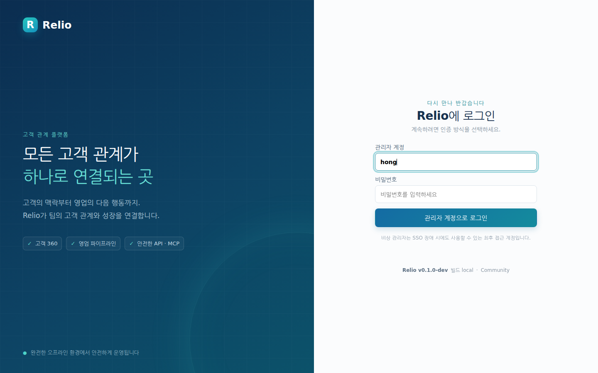

- **처음 로그인하면 비밀번호 변경 화면(`/me/password`)으로 바로 이동**합니다. 새 비밀번호를 정해야 다른 화면을 열 수 있습니다.
- 로그인은 되는데 "아직 사용 권한이 없습니다" 가 나오면 계정에 Role 이 없는 것입니다. [막혔을 때](#5-막혔을-때) 를 보세요.

### 2.2 영업 현황 확인

로그인하면 **영업 현황** 화면이 열립니다. 위에는 전체 고객·진행 영업기회·파이프라인 금액·이번 달 수주 네 숫자, 아래에는 **오늘 먼저 할 일** 과 **이탈 위험 고객** 이 있습니다.

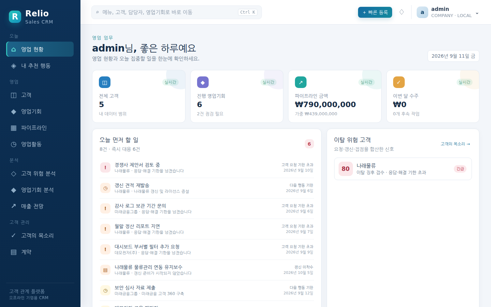

### 2.3 첫 고객 등록

1. 왼쪽 메뉴 **고객** 을 엽니다.
2. 오른쪽 위 **＋ 고객 등록** 을 누르고 고객명·유형(잠재/거래 고객)·업종을 입력한 뒤 저장합니다.
3. 목록에서 방금 만든 고객을 클릭하면 **고객 360** 화면이 열립니다.

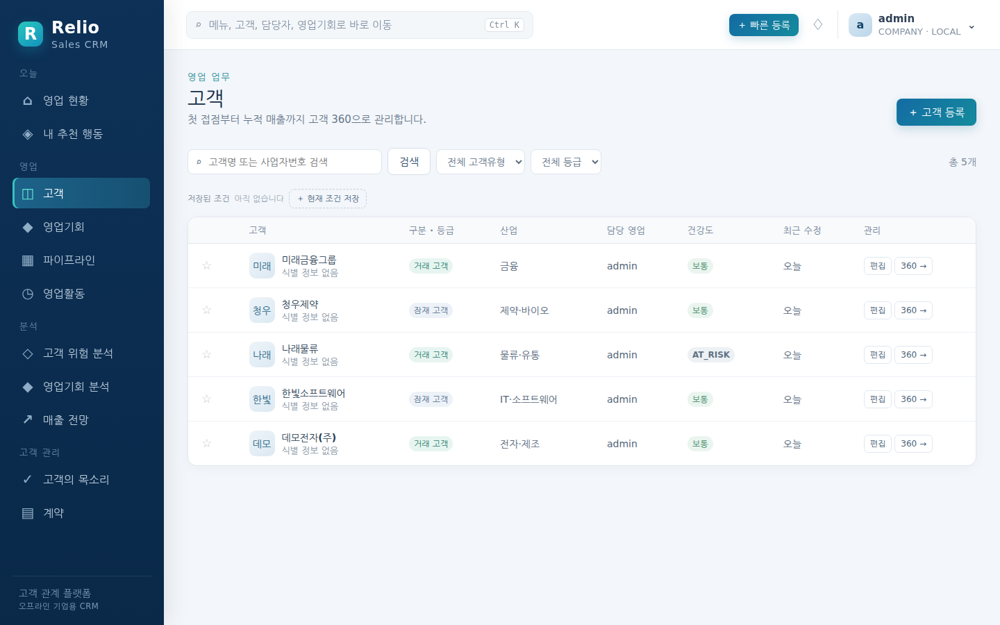

### 2.4 첫 영업기회 만들기

1. **영업기회** 메뉴에서 **＋ 영업기회 생성** 을 누릅니다.
2. 이름, 고객, 단계, 예상 금액, 예상 마감일, **다음 행동과 그 기한** 을 채웁니다.
3. 저장하면 목록에 나타나고, 다음 행동 기한이 오늘이면 **영업 현황 → 오늘 먼저 할 일** 에 바로 잡힙니다.

어디서든 `Ctrl+K`(Mac 은 `⌘K`)를 누르면 빠른 이동 창이 열립니다. 메뉴 이름, 고객명, 영업기회명을 치면 바로 열 수 있고, "고객 등록"·"영업기회 생성" 같은 등록 작업도 여기서 시작할 수 있습니다.

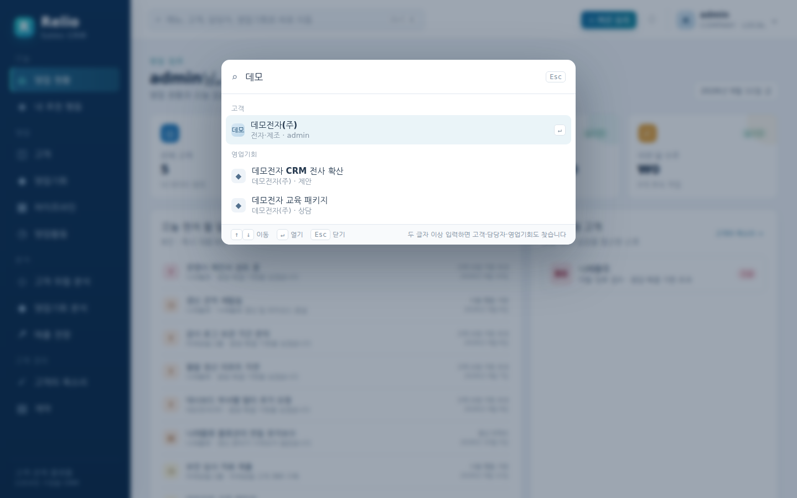

---

## 3. 화면별 사용법

### 3.1 영업 현황 (`/app/dashboard`)

로그인 직후 화면입니다. 숫자는 **내 데이터 범위**(관리자가 Role 에 정한 본인/팀/부서/본부/전사 범위) 기준입니다.

- **오늘 먼저 할 일**: 기한 초과 고객 요청, 다음 행동 기한, 갱신 미착수, 검토 대기가 즉시 대응 순으로 정렬됩니다. 항목을 클릭하면 해당 화면으로 갑니다.
- **이탈 위험 고객**: 이탈 징후·미해결 불만·갱신 미착수·접점 공백을 합산한 점수입니다. 점수 옆 "긴급" 은 즉시 확인 대상입니다.

### 3.2 내 추천 행동 (`/app/recommendations`)

분석 엔진이 나에게 제안하는 다음 행동입니다. **수락**하면 담당자와 기한이 있는 할 일이 되어 오늘 먼저 할 일에 나타나고, **무시**할 때는 사유를 남깁니다. 무시한 추천은 규칙이 다시 만들어 내지 않습니다 — 사람의 판단이 우선입니다.

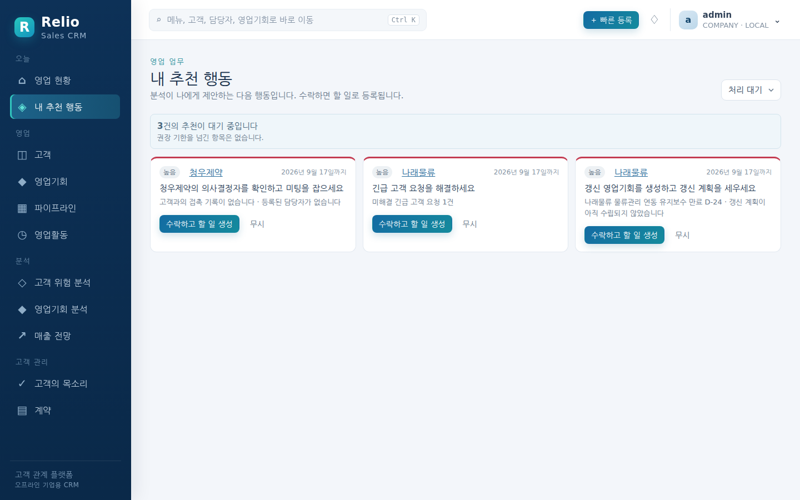

### 3.3 고객과 고객 360 (`/app/customers`)

고객 목록에서 검색·유형 필터·정렬을 쓰고, 별표를 눌러 **즐겨찾기** 에 담을 수 있습니다. 자주 쓰는 조건은 **현재 조건 저장** 으로 이름을 붙여 두면 다음부터 한 번에 적용됩니다.

고객을 열면 **고객 360** 입니다. 기본 정보, 담당자, 의사결정 관계도, 관계 분석 점수, 전략 고객 계획, 영업기회, 최근 활동이 한 화면에 세로로 이어집니다.

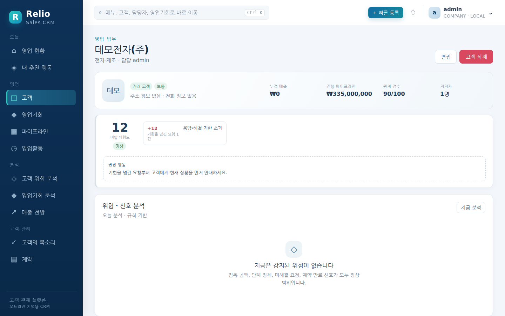

**의사결정 관계도** 에는 담당자마다 역할(의사결정자·지지자·영향력자·사용자·구매 담당), 영향력, 우리에 대한 성향, 관계 강도와 결정력이 표시되고, 담당자끼리의 관계(보고 라인·영향력 행사·신뢰 등)를 선으로 연결합니다. 오른쪽의 관계 분석 점수는 의사결정자·지지자 수와 우호/반대 비율로 계산됩니다.

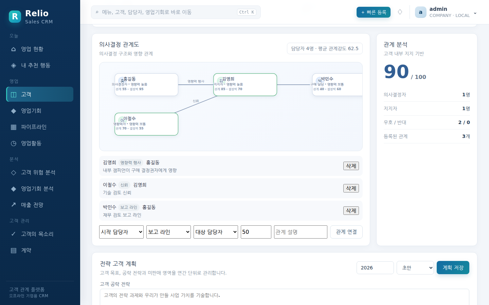

이 화면에서 하는 일:

- 담당자 **등록·수정·삭제** 와 역할·성향 지정
- 아래 폼에서 시작 담당자 → 관계 유형 → 대상 담당자 → 강도를 골라 **관계 연결**
- **전략 고객 계획** 에 연도별 공략 전략, 고객 목표, 경쟁사, 위험, 매출 목표와 미판매 영역(White Space)을 적고 **계획 저장**
- 고객 삭제는 `customer:delete` 권한이 있어야 하며, 영업기회·계약·요청 등 이력이 있으면 삭제 대신 비활성으로 전환됩니다.

### 3.4 영업기회 (`/app/opportunities`)

담당 범위의 영업기회를 단계·상태·전망 분류로 좁혀 봅니다. 금액은 거래통화 원금을 보존하고 화면 집계는 원화 기준금액으로 합니다.

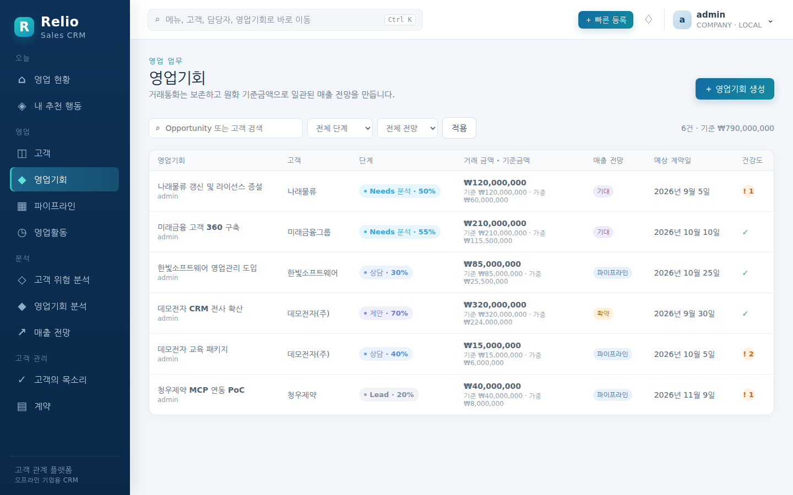

행을 클릭(또는 Tab 으로 이동해 Enter)하면 오른쪽에 **영업기회 점검** 서랍이 열립니다.

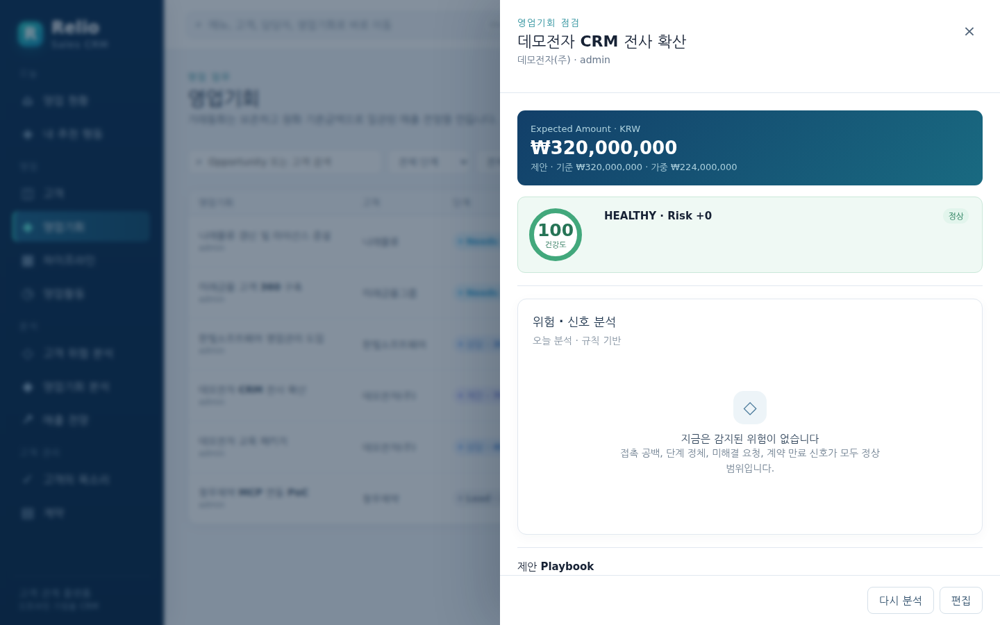

서랍에서 하는 일:

- **건강도(0~100)** 와 위험 등급, 그 점수를 만든 요인(접촉 공백, 단계 정체, 미해결 요청, 마감일 경과 등)을 봅니다. **다시 분석** 을 누르면 지금 상태로 다시 계산합니다.
- **Playbook**: 관리자가 단계마다 정해 둔 실행 지침과 전환 조건입니다. 항목을 완료 처리하며 진행합니다. 전환 조건이 `BLOCK` 인 단계는 조건을 채워야 다음 단계로 넘어갑니다.
- **편집** 으로 단계·금액·마감일·다음 행동을 바꿉니다. 다른 사람이 먼저 저장했으면 저장이 거부되니 다시 열어 확인합니다.
- 협업팀(Presales, Consultant, Manager, Legal)을 등록할 수 있습니다. 팀원으로 넣어도 그 사람의 데이터 범위는 넓어지지 않습니다.

### 3.5 파이프라인 (`/app/pipeline`)

같은 영업기회를 단계별 보드로 봅니다. 단계마다 건수와 원화 기준 합계가 표시되어 어느 단계에 금액이 몰려 있는지 바로 보입니다.

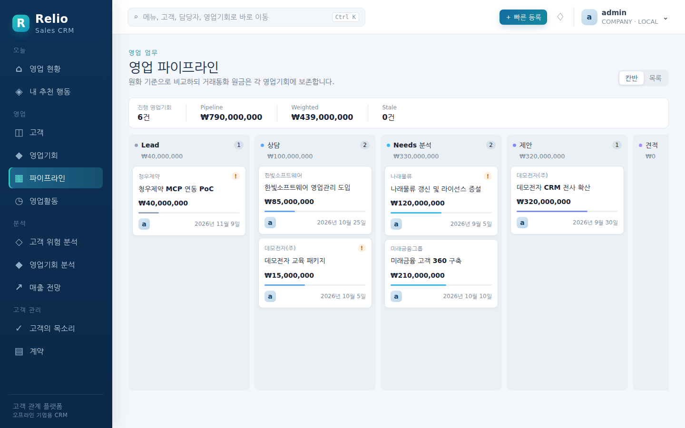

### 3.6 영업활동 (`/app/activities`)

미팅·통화·방문·이메일을 고객·영업기회에 연결해 시간 순으로 남깁니다. **＋ 활동 기록** 에서 활동 유형과 제목은 필수이고, **다음 행동과 기한** 을 함께 적으면 오늘 먼저 할 일에 연결됩니다. 접점에서 불만이나 요청이 나왔다면 활동 기록 화면에서 바로 고객 요청을 접수할 수 있습니다.

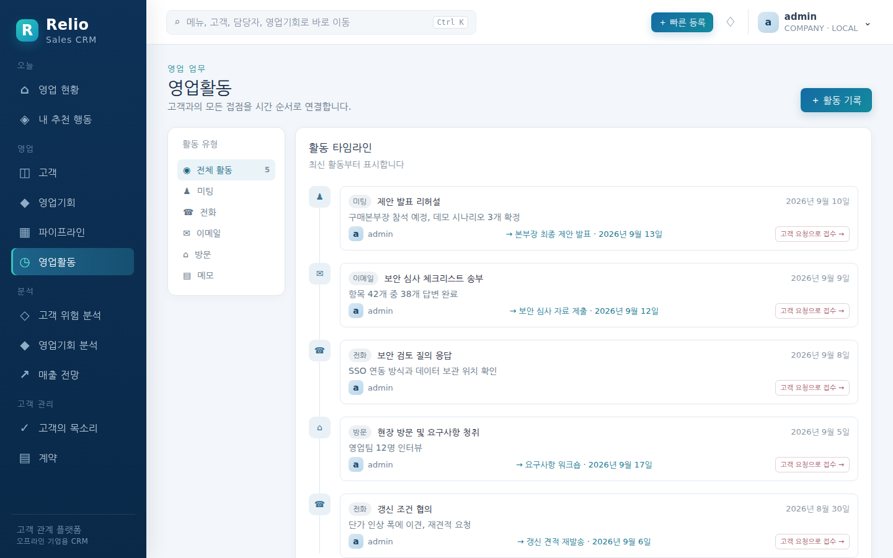

### 3.7 고객 위험 분석 (`/app/intelligence-center`)

담당 범위에서 감지된 **위험**(0~100 점수)과 **신호** 를 한곳에서 봅니다. 위험 점수는 그것을 만든 요인과 배점을 그대로 보여 주고, 조건이 해소되면 자동으로 회수됩니다. 감수하기로 한 위험은 규칙 엔진이 되살리지 않습니다.

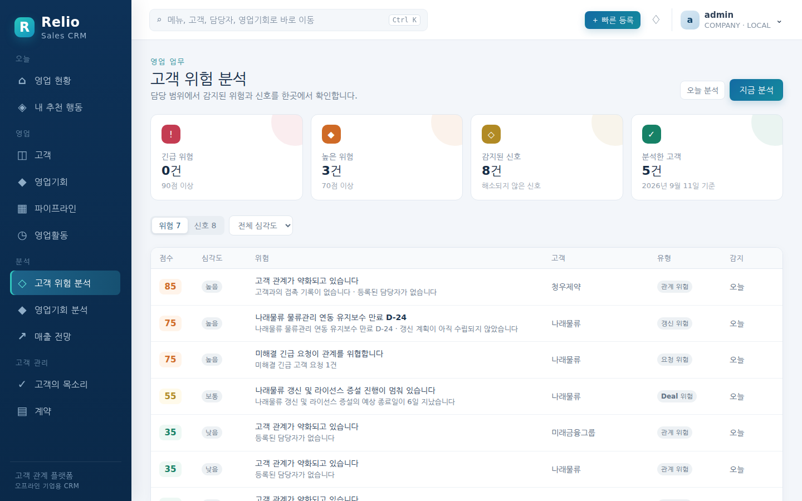

- 분석은 매일 자동으로 돌지만 **지금 분석** 을 누르면 즉시 다시 계산합니다.
- 위험 유형: 관계 위험(담당자·접촉 없음), 갱신 위험(계약 만료 D-day), 요청 위험(미해결 긴급 요청), Deal 위험(마감일 경과·정체).

### 3.8 영업기회 분석 (`/app/intelligence`)

팀장용 화면입니다. 위험 영업기회를 건강도 순으로 보여 주고, 아래 **영업 코칭** 에서 담당자별 위험 딜과 실행 공백을 봅니다.

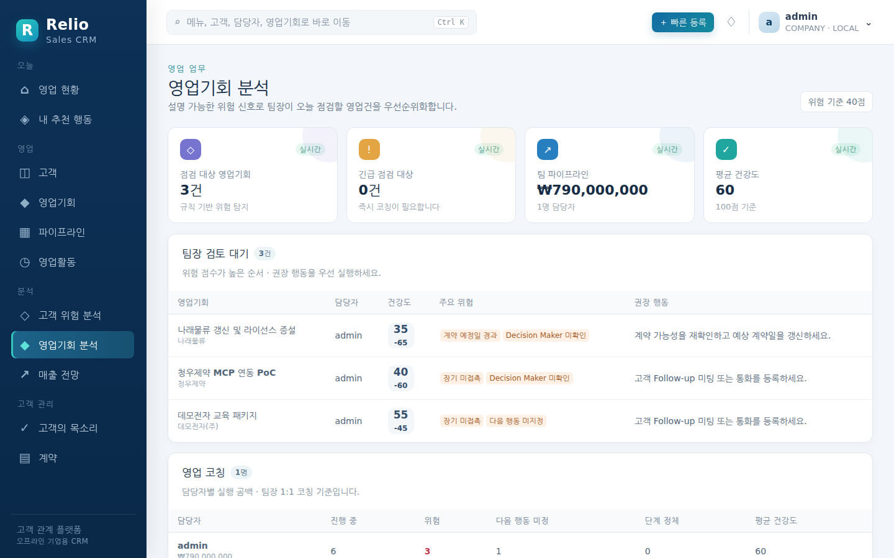

### 3.9 매출 전망 (`/app/forecast`)

파이프라인을 전망 분류(확약 / 기대 / 파이프라인)로 나눠 집계하고, 매일 저장되는 Snapshot 을 비교해 무엇이 변했는지(신규, 금액 증감, 실주, 마감 지연) 보여 줍니다. 팀장은 담당자의 추정과 별개로 **Manager Override** 금액과 사유를 기록할 수 있습니다.

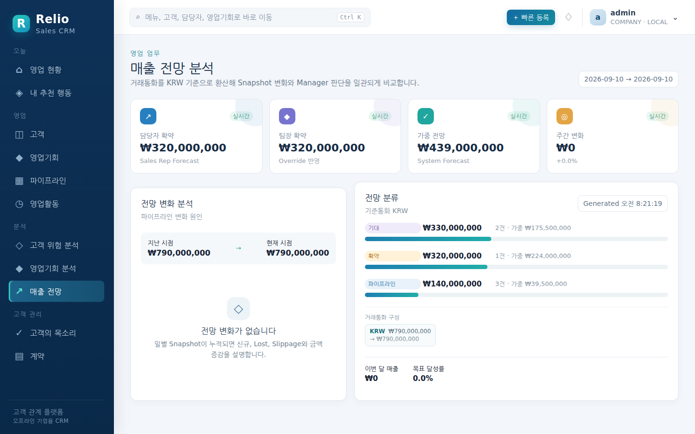

### 3.10 고객의 목소리 (`/app/voices`)

불만·요청·문의·결함·칭찬·이탈 징후를 접수부터 해결·만족도까지 추적합니다. 상단 카드는 처리 중·기한 초과·긴급·이탈 징후·최근 30일 해결·만족도이고, 카드를 누르면 그 조건으로 목록이 좁혀집니다.

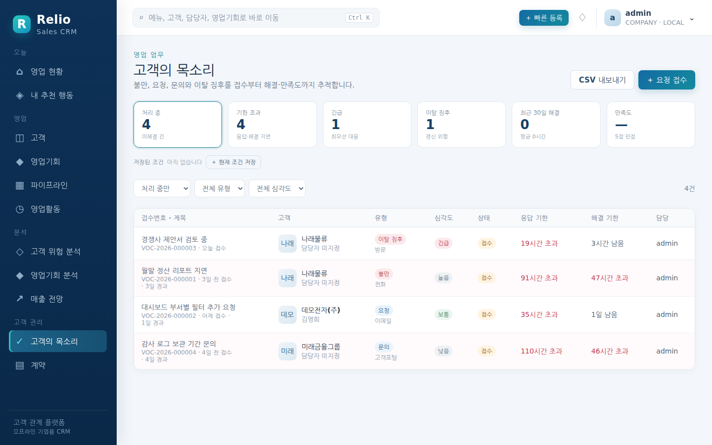

- **＋ 요청 접수**: 고객, 담당자(없으면 그 자리에서 새로 등록), 유형, 채널, 심각도, 제목·내용을 적습니다. 접수번호(`VOC-2026-000001` 형식)가 자동으로 붙습니다.
- **응답 기한·해결 기한** 은 관리자가 유형별로 정한 SLA 에서 자동 계산되며, 심각도가 높으면 짧아집니다. 빨간 "초과" 는 즉시 대응 대상입니다.
- 요청을 열어 상태(접수 → 내용 확인 → 진행 중 → 고객 회신 대기 → 해결 → 종료)를 바꾸고, 해결 시 조치 내용·원인·재발 방지책·만족도를 남깁니다. 접수에서 곧바로 종료로 건너뛸 수는 없습니다.
- **CSV 내보내기** 는 관리자가 내보내기를 허용한 경우에만 보입니다.

### 3.11 계약 (`/app/contracts`)

계약을 등록하고 **계약 활성화 · 일정 생성** 을 누르면 인식 주기(일시·월·분기·연)에 맞춰 매출 인식 일정이 자동으로 나뉩니다. 일정마다 인식 처리를 하고, 만료가 다가오면 갱신 다음 행동이 오늘 먼저 할 일에 올라옵니다.

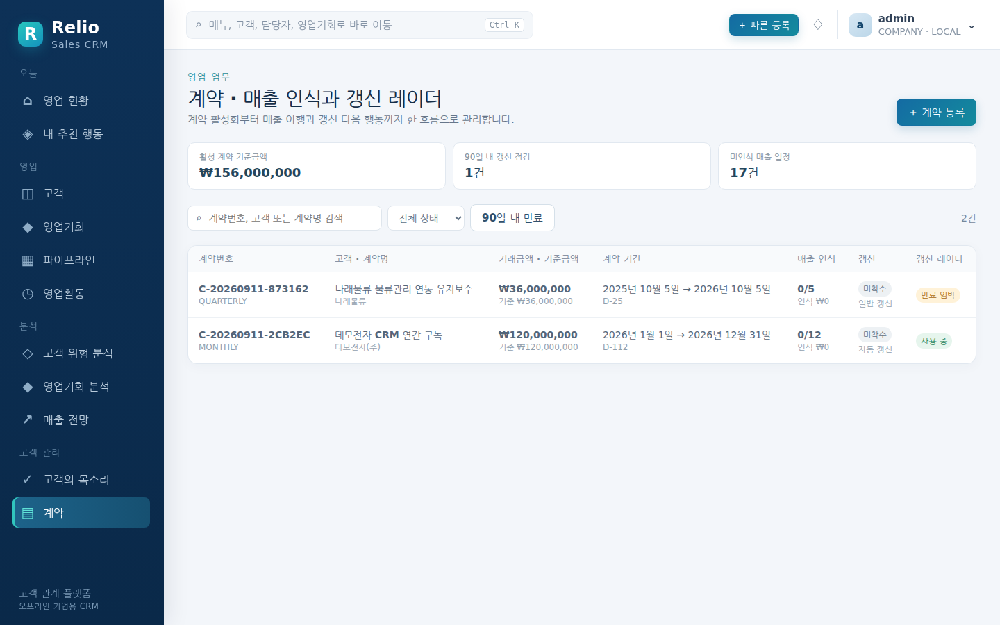

- 계약번호는 `C-<날짜>-<식별자>` 형식으로 자동 부여됩니다.
- 기간과 주기의 조합이 일정 600건(월별 50년)을 넘으면 등록이 거절됩니다. 종료일 오타를 잡기 위한 상한입니다.

### 3.12 개인 업무 (`/me/*`)

오른쪽 위 프로필 메뉴에서 개인 업무 영역으로 들어갑니다.

- **내 현황**: 내 담당 범위의 실적과 오늘 처리할 일
- **내 영업목표**: 기간별 목표와 달성률
- **내 일정**: 예정된 다음 행동과 임박한 후속 작업
- **내 알림**, **저장된 검색**, **즐겨찾기**
- **로그인 세션**: 활성 로그인 위치를 확인하고 개별 접속을 종료
- **활동 기록**: 화면·API·MCP 에서 수행한 나의 활동 이력
- **Relio 정보**: 실행 중인 버전과 빌드

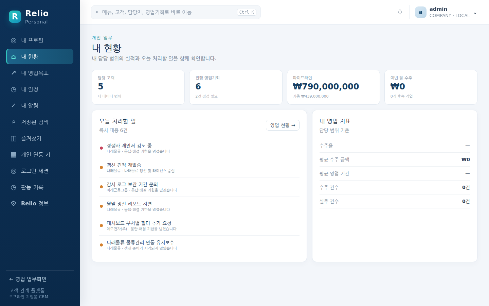

### 3.13 개인 연동 키 (`/me/keys`)

REST API 와 MCP 로 Relio 를 쓰기 위한 접근 키입니다.

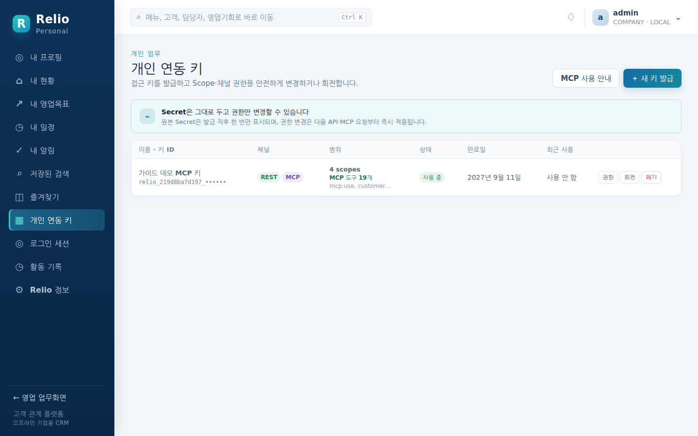

1. **＋ 새 키 발급** 을 누르고 이름, 범위(Scope), 채널(REST / MCP)을 고릅니다. 조회/입력 일괄 선택과 용도별 프리셋이 있습니다.
2. 발급 직후 **한 번만** 표시되는 Secret(`relio_` 로 시작)을 안전한 곳에 보관합니다. 서버는 원본을 저장하지 않으므로 다시 볼 수 없습니다.
3. **권한** 으로 범위와 채널을 바꿀 수 있습니다. Secret 은 그대로이고 다음 요청부터 적용됩니다.
4. **회전** 은 새 Secret 을 발급하고 옛 Secret 을 유예 기간 동안 함께 유지합니다. **폐기** 는 즉시 무효화합니다.
5. **MCP 사용 안내** 버튼에 연결 방법과 문제 해결 안내가 있습니다.

---

## 4. 자주 하는 작업

### 미팅을 마치고 다음 행동 남기기

1. **영업활동 → ＋ 활동 기록**
2. 고객·영업기회를 고르고 유형(미팅)·제목·내용을 적습니다.
3. **다음 행동** 과 **기한** 을 채우고 **활동 저장**. 기한이 오늘이면 영업 현황의 오늘 먼저 할 일에 바로 나타납니다.

### 영업기회를 다음 단계로 옮기기

1. 영업기회 목록에서 행을 열어 **Playbook** 항목을 완료 처리합니다.
2. **편집** 에서 단계를 바꿉니다. 전환 조건이 `WARNING` 이면 경고만 보이고, `BLOCK` 이면 `stage exit criteria blocked: …` 메시지와 함께 저장이 거부됩니다 — 메시지에 적힌 조건을 채운 뒤 다시 시도합니다.

### 고객 불만 접수부터 해결까지

1. **고객의 목소리 → ＋ 요청 접수**. 유형을 "불만", 심각도를 실제 수준으로 고릅니다. 심각도가 높을수록 응답·해결 기한이 짧아집니다.
2. 목록에서 요청을 열어 상태를 **내용 확인 → 진행 중** 으로 옮기며 메모를 남깁니다.
3. 해결되면 상태를 **해결** 로 바꾸고 조치 내용·원인·재발 방지책을 적습니다. 만족도(1~5)까지 남기면 상단 만족도 카드에 반영됩니다.

### 계약 활성화와 매출 인식

1. **계약 → ＋ 계약 등록**. 고객, 영업기회, 금액, 시작·종료일, 인식 주기, 갱신 통지일을 적고 **초안** 으로 저장합니다.
2. 조건이 확정되면 **계약 활성화 · 일정 생성**. 일정이 주기별로 만들어집니다.
3. 매출이 인식될 때마다 해당 일정에서 인식 처리합니다. 갱신 통지일이 오면 갱신 다음 행동이 오늘 먼저 할 일에 올라옵니다.

### 월말에 고객 요청 목록 내보내기

**고객의 목소리** 에서 상태·유형·심각도 필터를 맞춘 뒤 **CSV 내보내기**. 파일명에 그날 날짜가 붙습니다. 버튼이 보이지 않으면 관리자가 내보내기를 꺼 둔 것입니다.

### AI Agent 에 연결하기 (MCP)

개인 연동 키를 `mcp:use` 와 필요한 조회 범위로 발급한 뒤 도구에 등록합니다. 서버 주소는 `https://<relio 주소>/mcp` 입니다.

Qwen Code:

```bash
qwen mcp add --scope user --transport http relio https://relio.company.internal/mcp \
  --header "Authorization: Bearer <발급받은 Secret>"
```

OpenCode:

```bash
opencode mcp add relio --url https://relio.company.internal/mcp \
  --header "Authorization=Bearer <발급받은 Secret>"
```

Qwen 설정 파일에서는 `url` 이 아니라 `httpUrl` 을 써야 하고, OpenCode CLI 의 헤더는 `KEY=VALUE` 형식입니다. 사용할 수 있는 도구 목록(`search_customers`, `find_deals_at_risk`, `get_account_brief` 등)은 [REST API and MCP](api-mcp.md) 에 있습니다. 관리자가 도구 허용 목록을 좁혀 두면 그 도구만 보입니다.

---

## 5. 막혔을 때

| 화면에 보이는 메시지 | 뜻 | 할 일 |
|---|---|---|
| `아이디 또는 비밀번호가 올바르지 않습니다.` | 자격 증명 불일치. 비활성 계정도 같은 메시지입니다. | 다시 입력. 계속 실패하면 관리자에게 **사용자 · 조직 → 비밀번호** 재설정을 요청합니다. |
| `로그인 시도가 너무 많습니다. 잠시 후 다시 시도하세요.` | 같은 주소에서 로그인 실패가 반복되어 잠시 차단됨 | 몇 분 뒤 다시 시도합니다. |
| `일반 로컬 로그인이 비활성화되어 있습니다.` | 관리자가 SSO 만 허용함 | SSO 버튼으로 로그인합니다. |
| 로그인 후 **아직 사용 권한이 없습니다** 화면 | 계정에 Role 이 없음 | 관리자에게 화면에 표시된 계정명으로 Role 부여를 요청합니다. |
| 로그인 직후 비밀번호 변경 화면으로 이동 | 첫 로그인이거나 관리자가 비밀번호를 재설정함 | 새 비밀번호를 정하면 원래 가려던 화면으로 돌아갑니다. |
| `요청한 데이터를 찾을 수 없거나 접근 권한이 없습니다.` | 삭제됐거나 내 데이터 범위 밖 | 즐겨찾기·저장된 검색의 옛 링크일 수 있습니다. 목록에서 다시 찾고, 범위 문제면 관리자에게 데이터 범위를 문의합니다. |
| `… was changed by another user` | 내가 여는 사이 다른 사람이 먼저 저장함 | 화면을 다시 열어 최신 값을 확인하고 다시 저장합니다. 내 변경은 덮어쓰지 않았습니다. |
| `stage exit criteria blocked: …` | 단계 전환 조건(`BLOCK`) 미충족 | 메시지에 적힌 Playbook 항목을 완료한 뒤 다시 옮깁니다. |
| `owner change requires admin:write permission` | 담당자 변경은 관리자 권한 필요 | 관리자에게 요청합니다. |
| `서버 오류가 발생했습니다.` | 서버 쪽 문제 | 잠시 후 재시도. 반복되면 화면의 요청 ID(있는 경우)와 시각을 관리자에게 전달합니다. 관리자는 감사 로그와 컨테이너 로그에서 같은 ID 를 찾을 수 있습니다. |
| 세션이 끊겨 로그인 화면으로 돌아감 | 접속 유지 시간(기본 8시간) 초과 또는 다른 곳에서 세션 종료 | 다시 로그인합니다. 작성 중이던 내용은 저장되지 않았습니다. |
| **CSV 내보내기** 버튼이 없음 | 관리자가 내보내기를 꺼 둠 | 관리자에게 문의합니다. |
| **검토 · 승인** 메뉴가 없음 | 활성 승인 정책이 없음 — 정상 | 승인이 필요하면 관리자가 **승인 절차** 에서 정책을 만들어야 합니다. |

---

## 6. 용어

| 용어 | 뜻 |
|---|---|
| 데이터 범위 | 내가 볼 수 있는 데이터의 넓이. 본인 / 팀 / 부서 / 본부 / 전사 중 관리자가 Role 에 정합니다. 기능 권한과 별개입니다. |
| 건강도 | 영업기회의 0~100 점수. 접촉 공백, 단계 정체, 금액·확률 급락, 마감일 경과, 의사결정자·지지자 부재 등을 규칙별 배점으로 합산합니다. |
| 위험 / 신호 | 신호는 감지된 사실(예: 접촉 없음 30일), 위험은 신호를 합산한 0~100 점수와 심각도입니다. |
| 추천 행동 | 위험이 임계값을 넘을 때 제안되는 다음 행동. 수락하면 할 일이 됩니다. |
| 전망 분류 | 확약(COMMIT) / 기대(BEST_CASE) / 파이프라인(PIPELINE). 매출 전망 집계의 기준입니다. |
| 기준금액 | 거래통화 금액을 생성 시점 환율로 원화 환산한 값. 집계는 모두 이 값으로 합니다. |
| Playbook / 전환 조건 | 단계별 실행 지침과, 다음 단계로 가기 위한 필수 조건. 조건 강도는 관리자가 OFF / WARNING / BLOCK 으로 정합니다. |
| Snapshot | 매일 저장되는 매출 전망 시점 기록. 오늘과 비교해 변화 원인을 봅니다. |
| Manager Override | 담당자의 추정과 별개로 팀장이 기록하는 전망 금액과 사유. |
| 매출 인식 일정 | 계약 활성화 시 인식 주기별로 나뉜 매출 계획. 일정마다 인식 처리합니다. |
| SLA | 고객 요청 유형별 응답·해결 목표 시간. 관리자가 정하고 심각도에 따라 자동 단축됩니다. |
| 개인 연동 키 | REST API·MCP 용 접근 키. 서버는 HMAC Digest 만 저장하며 Secret 은 발급 시 한 번만 보입니다. |
| MCP | AI Agent 가 Relio 도구를 호출하는 프로토콜. 주소는 `/mcp`, 인증은 개인 연동 키입니다. |
